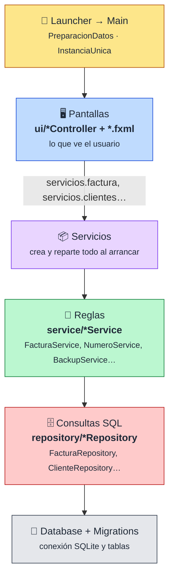
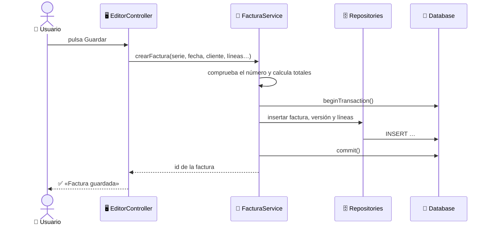
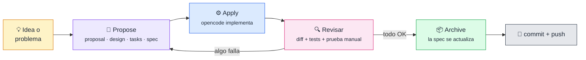

<div align="center">


# CaboFactu®

**Aplicación de escritorio para hacer facturas, rectificativas y copias de seguridad, sin hojas de cálculo.**


</div>

---

## 👋 Sobre el proyecto

¡Hola! Soy **[@jribanezgarcia](https://github.com/jribanezgarcia)**, estudiante de **DAM**, y este es mi proyecto de facturación.

La idea nació de algo real: una empresa hacía sus facturas a mano en una hoja de cálculo. **CaboFactu** sustituye ese proceso por una aplicación de escritorio para Windows, **local y de un solo usuario**, que guarda cada factura con su historial de versiones y la exporta a PDF.

Además de programar, con este proyecto estoy aprendiendo a trabajar **como en un equipo de verdad**: primero se escribe qué se va a cambiar (una *spec*), después se implementa y al final se revisa. Lo explico más abajo en [🧭 Metodología](#-metodología-opencode--openspec).

---

## ✨ Qué hace

| | Funcionalidad |
|---|---|
| 🧾 | **Facturas** con cliente, líneas, descuento general, varios tipos de IVA, retención de IRPF, suplidos y datos de pago |
| 🔢 | **Series de numeración** con formato por mes, por año o sin sufijo, y correlativo independiente por ejercicio |
| 🕓 | **Versiones**: cada cambio puede guardarse como versión nueva y se consulta desde el histórico |
| ↩️ | **Rectificativas** creadas desde la factura original, con la referencia generada sola |
| 🚫 | **Anular y restaurar** facturas conservando el registro |
| 📅 | **Facturación mensual**: genera de golpe las facturas de un cliente para varios meses |
| 🔎 | **Histórico** con filtros por serie, cliente, fechas, importes y estado |
| 📄 | **Exportación a PDF** con cabecera de texto o logo, pie legal y color de acento configurable |
| 🏢 | **Varias empresas** con los datos totalmente separados |
| 💾 | **Copias de seguridad** y restauración en la empresa activa o como empresa nueva |
| 🎨 | **7 temas** de apariencia: biblioteca8, omarchy, esmeralda, terracota, negro-dorado, sakura y neon |
| 🧪 | **Empresa de demostración** con datos ficticios que se carga sola en una instalación nueva |

---

## 📸 Capturas

<table>
  <tr>
    <td align="center"><b>🏠 Menú principal</b><br/></td>
    <td align="center"><b>🧾 Editor de facturas</b><br/></td>
  </tr>
  <tr>
    <td align="center"><b>🔎 Histórico</b><br/></td>
    <td align="center"><b>📄 PDF generado</b><br/></td>
  </tr>
</table>

---

## 🏗️ Cómo está montado

La aplicación sigue un **MVC por capas**. La regla de oro: **cada clase se encarga de una sola cosa**.



### 📁 Paquetes

```text
src/main/java/com/alcazaba/facturacion/
├── 🚀 Main, Launcher, PreparacionDatos, InstanciaUnica   → arranque
├── 🖥️ ui/          → controladores JavaFX, navegación, diálogos y temas
├── 🧠 service/     → reglas de negocio y el contenedor Servicios
├── 🗄️ repository/  → una clase de consultas SQL por tabla
├── 🔌 db/          → conexión, migraciones y datos de demostración
├── 🧩 model/       → clases de datos: Cliente, Factura, LineaFactura, Serie…
├── 📄 pdf/         → generación del PDF
└── 🛠️ util/        → formatos y validadores (NIF, código postal, email)
```

### 🔄 Ejemplo: qué pasa al pulsar «Guardar factura»



> [!TIP]
> Si vienes de un MVC «clásico» con una clase de conexión y un DAO por modelo: aquí `Database` hace de clase de conexión, los `*Repository` son los DAO y los `*Service` son una capa extra donde viven las reglas, para que ni la pantalla ni el DAO decidan cosas de negocio.

---

## 🧭 Metodología: opencode + OpenSpec

Cada cambio del proyecto, por pequeño que sea, sigue **el mismo ciclo**. Así nunca se programa «a ciegas» y queda escrito por qué se hizo cada cosa.



> [!NOTE]
> **Qué hago yo y qué hace la IA.** Las herramientas de IA me ayudan a proponer, escribir y revisar código, pero **las decisiones son mías**: qué se cambia, qué opción se elige entre las propuestas, qué se descarta y cuándo un cambio está bien. Y cada cambio lo pruebo yo a mano en la aplicación antes de archivarlo.

| Paso | Quién | Qué se hace |
|---|---|---|
| 📝 **Propose** | Yo + **Claude Code** | Se crea una carpeta en `openspec/changes/<nombre>/` con `proposal.md` (por qué), `design.md` (cómo y qué se descartó), `tasks.md` (pasos concretos) y, si cambia el comportamiento, la *spec* |
| ⚙️ **Apply** | **opencode** | `/opsx-apply <nombre>` implementa las tareas y ejecuta los tests |
| 🔍 **Revisar** | Yo + **Claude Code** | Se revisa el diff, se pasa `mvn test` y hago las pruebas manuales en la app |
| 📦 **Archive** | **opencode** | `/opsx-archive <nombre>` mueve el cambio a `openspec/changes/archive/` y actualiza la especificación |

📚 La especificación completa, con todos los requisitos y escenarios, está en [`openspec/specs/`](openspec/specs/).

> [!NOTE]
> Antes de un cambio grande se hace una **auditoría** (dependencias, capas, preparación para otras bases de datos…) y de ahí sale una cola ordenada de cambios pequeños. Prefiero muchos cambios pequeños y revisables a uno enorme.

---

## 🚀 Cómo arrancarlo

### Requisitos

- ☕ **JDK 21**
- 📦 **Maven** 3.8 o superior
- 🪟 **Windows** (la carpeta de datos usa `%APPDATA%`)

### Ejecutar

```bash
# Opción 1: script incluido (Windows)
lanzar.bat

# Opción 2: con Maven
mvn javafx:run
```

### Tests

```bash
mvn test
```

### 🗂️ Dónde se guardan los datos

```text
%APPDATA%\Facturacion\
├── empresas.properties        → nombres de las empresas
├── preferencias.properties    → tema y última empresa usada
└── <empresa>\facturas.db      → una base de datos SQLite por empresa
```

> [!IMPORTANT]
> En la primera ejecución se carga una **empresa de demostración** con datos ficticios. Para trabajar con tu empresa, créala desde la pantalla de arranque con **«Nueva…»** y completa sus datos fiscales en Configuración.

---

## 🎓 Lo que he aprendido

Este proyecto me ha servido para practicar muchas cosas que en clase se ven por separado:

- 🧱 **Separar en capas.** Pantalla, reglas y consultas SQL cada una en su sitio. Al principio me parecía «más clases para nada», pero cuando hay que cambiar algo se nota muchísimo.
- 🔒 **Transacciones.** Guardar una factura toca tres tablas: o se guarda todo o no se guarda nada (`commit` / `rollback`).
- 🧪 **Tests automáticos.** Más de 200 tests con JUnit 5 que se pasan antes de dar cada cambio por bueno.
- 🕰️ **Probar fechas.** Inyectar un `Clock` en lugar de usar `LocalDate.now()` para poder fijar la fecha en los tests.
- 🚨 **Excepciones.** Traducir los errores de la base de datos en los repositorios para que la pantalla no dependa de `SQLException`.
- 📝 **Escribir antes de programar.** Con OpenSpec cada cambio empieza por explicar *por qué* y *qué se descarta*, y eso evita muchos errores.
- 🤖 **Trabajar con IA con cabeza.** opencode y Claude Code ayudan muchísimo, pero hay que revisar lo que hacen: en una auditoría uno de los modelos se inventó clases que no existían y solo se vio comprobándolo en el código.
- 🔁 **Pedir cambios pequeños.** Mejor muchos cambios pequeños y revisables que uno gigante imposible de probar.

---

## 🗺️ Próximos pasos

- [x] Separar reglas y consultas SQL en capas
- [x] Reloj inyectable para poder probar fechas
- [x] Datos de empresa obligatorios y empresa de demostración
- [x] `Main` más corto y ordenado
- [ ] Sacar todo el SQL de pantallas y servicios
- [ ] Nombres de clases y paquetes en español
- [ ] Preparación para **VeriFactu** y factura electrónica
- [ ] Poder cambiar SQLite por **PostgreSQL**

---

<div align="center">

Hecho con ☕ y muchas horas de aprendizaje por **[@jribanezgarcia](https://github.com/jribanezgarcia)**


</div>
