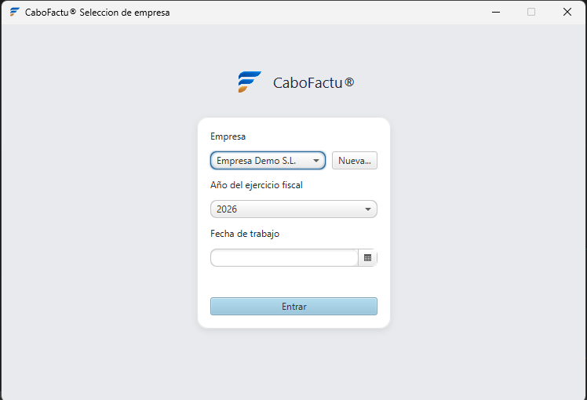
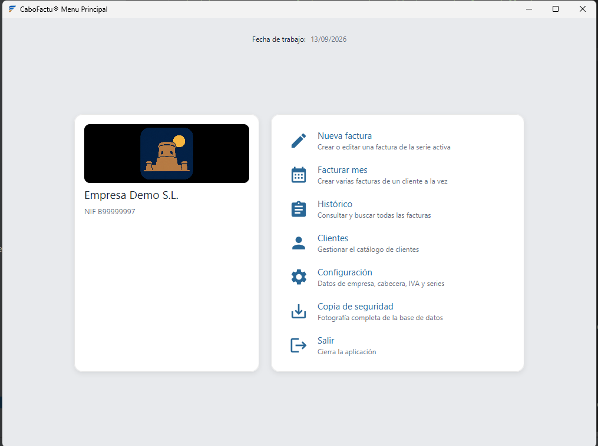
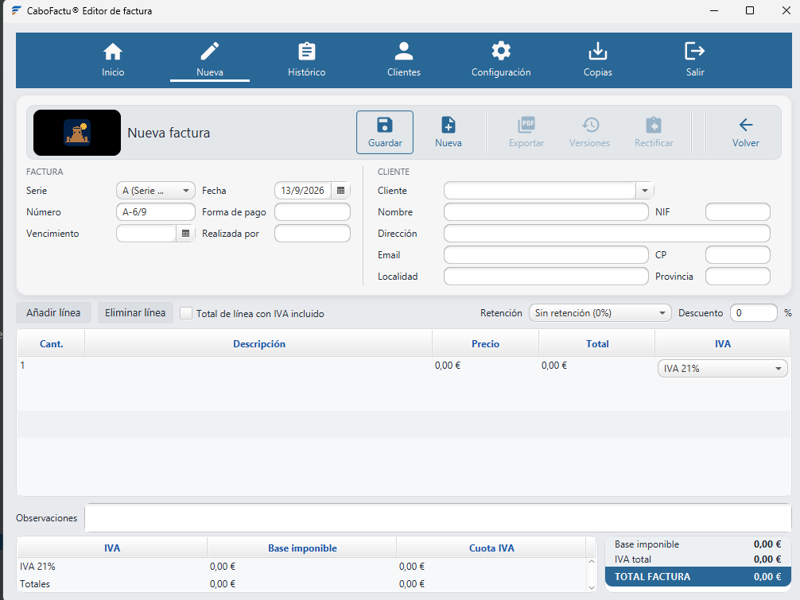
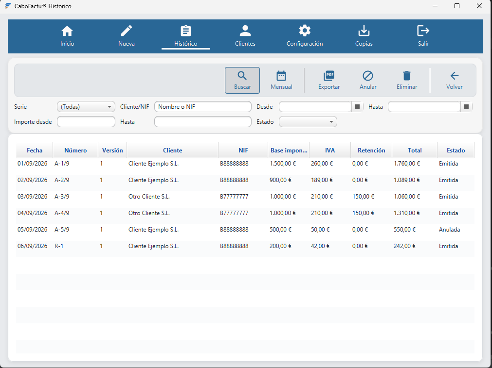
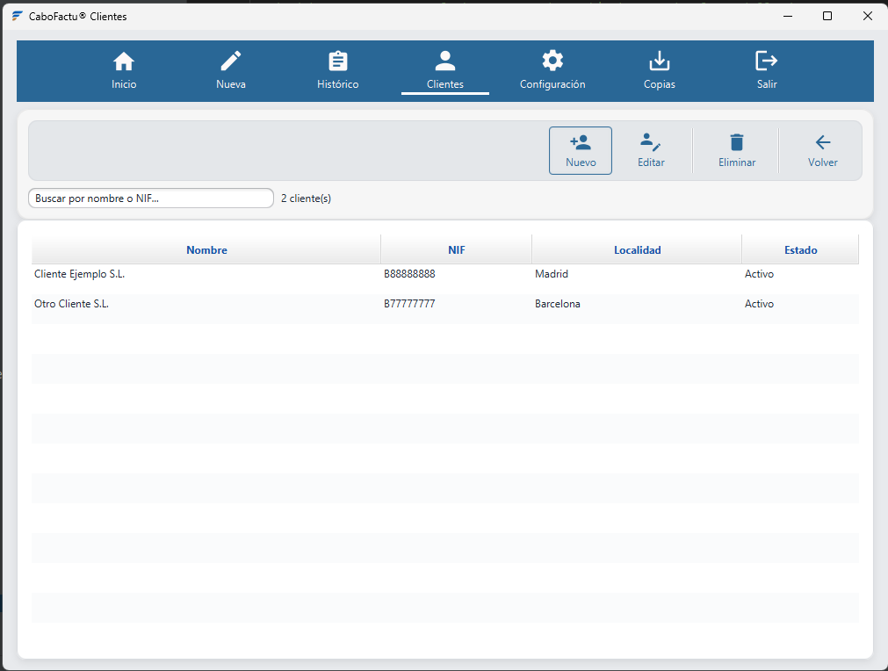
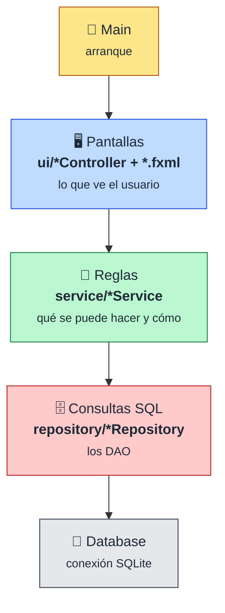

<div align="center">


# CaboFactu®

**De una hoja de Excel a una aplicación de escritorio con base de datos:<br/>facturación real, con historial, versiones y copias de seguridad.**


📐 [Documentación técnica](docs/tecnico.md) · 🧭 [Metodología](docs/metodologia.md) · 📚 [Especificación](openspec/specs/)

</div>

---

## 👋 Sobre el proyecto

¡Hola! Soy **[@jribanezgarcia](https://github.com/jribanezgarcia)**, estudiante de **DAM**.

**CaboFactu** nace de un problema real: una empresa llevaba toda su facturación en **una hoja de Excel**. Funcionaba, pero cada factura dependía de copiar la anterior, cambiar el número a mano y confiar en que ninguna fórmula se hubiera roto. Mi objetivo ha sido convertir ese proceso en **una aplicación de escritorio con persistencia en base de datos**, que haga lo mismo que la hoja pero sin sus riesgos, y añada lo que la hoja no podía dar.

### 📊 Antes y después

| | 📗 Con la hoja de Excel | 💻 Con CaboFactu |
|---|---|---|
| 🔢 **Numeración** | Se escribía a mano: fácil repetir o saltarse un número | Correlativa por serie y por año, calculada por la aplicación, que avisa si un número ya existe |
| 🧮 **Cálculos** | Fórmulas que se podían borrar o arrastrar mal | IVA, retención, descuento y suplidos calculados con `BigDecimal` y comprobados con tests |
| 🗄️ **Datos** | Un fichero por factura o una pestaña por mes | Una base de datos **SQLite** por empresa, con transacciones |
| 🕓 **Historial** | Si se corregía una factura, la anterior se perdía | **Versiones**: se puede guardar cada cambio y consultar las anteriores |
| ↩️ **Correcciones** | Copiar la factura y retocarla | **Rectificativas** creadas desde la original, con la referencia automática |
| 🔎 **Búsquedas** | Buscar a ojo entre ficheros | **Histórico** con filtros por serie, cliente, fechas, importes y estado |
| 📄 **PDF** | Exportar desde Excel cuidando que no se descuadrara | PDF generado con cabecera, logo, pie legal y color configurables |
| 💾 **Copias** | Copiar el fichero a mano (si alguien se acordaba) | **Copias de seguridad** consistentes y restauración con copia de rescate |
| 🏢 **Varias empresas** | Una hoja distinta y a mezclar | Empresas con los datos **totalmente separados** |

---

## ✨ Qué hace

| | Funcionalidad |
|---|---|
| 🧾 | **Facturas** con cliente, líneas, descuento general, varios tipos de IVA, retención de IRPF, suplidos y datos de pago |
| 🔢 | **Series de numeración** con formato por mes, por año o sin sufijo, y correlativo independiente por ejercicio |
| 🕓 | **Versiones** de cada factura, consultables desde el histórico |
| ↩️ | **Rectificativas** creadas desde la factura original |
| 🚫 | **Anular y restaurar** facturas conservando el registro |
| 📅 | **Facturación mensual**: genera de golpe las facturas de un cliente para varios meses |
| 🔎 | **Histórico** con filtros combinados |
| 📄 | **Exportación a PDF** con cabecera de texto o logo, pie legal y color de acento |
| 🏢 | **Varias empresas**, con sus datos fiscales obligatorios antes de empezar |
| 💾 | **Copias de seguridad** y restauración en la empresa activa o como empresa nueva |
| 🎨 | **7 temas** de apariencia: biblioteca8, omarchy, esmeralda, terracota, negro-dorado, sakura y neon |
| 🧪 | **Empresa de demostración** con datos ficticios que se carga sola en una instalación nueva |

---

## 📸 Capturas

<table>
  <tr>
    <td align="center"><b>🚪 Pantalla de arranque</b><br/></td>
    <td align="center"><b>🏠 Menú principal</b><br/></td>
  </tr>
  <tr>
    <td align="center"><b>🧾 Editor de facturas</b><br/></td>
    <td align="center"><b>🔎 Histórico</b><br/></td>
  </tr>
  <tr>
    <td align="center" colspan="2"><b>👥 Clientes</b><br/></td>
  </tr>
</table>

---

## 🏗️ Cómo está montado (resumen)

La aplicación sigue un **MVC por capas**. La regla de oro: **cada clase se encarga de una sola cosa**.



> [!TIP]
> **💡 Concepto.** Si en clase has visto un MVC con una clase de conexión y un DAO por modelo, aquí es igual con una capa más: `Database` es la conexión, los `*Repository` son los DAO y los `*Service` guardan las **reglas de negocio**, para que ni la pantalla ni el DAO tomen decisiones.

👉 Paquetes, ejemplo paso a paso, modelo de datos y decisiones técnicas en **[docs/tecnico.md](docs/tecnico.md)**.<br/>
👉 Cómo se desarrolla con opencode + OpenSpec, con un cambio real de ejemplo y la auditoría con IA, en **[docs/metodologia.md](docs/metodologia.md)**.

---

## 🚀 Cómo arrancarlo

**Requisitos:** ☕ JDK 21 · 📦 Maven 3.8+ · 🪟 Windows

```bash
lanzar.bat          # script incluido
mvn javafx:run      # o con Maven
mvn test            # tests
```

Los datos se guardan en `%APPDATA%\Facturacion\`, con una base de datos SQLite por empresa.

> [!IMPORTANT]
> En la primera ejecución se carga una **empresa de demostración** con datos ficticios. Para trabajar con tu empresa, créala desde la pantalla de arranque con **«Nueva…»** y completa sus datos fiscales en Configuración.

---

## 🎓 Lo que he aprendido

- 🧱 **Separar en capas.** Pantalla, reglas y consultas SQL cada una en su sitio. Al principio me parecía «más clases para nada», pero cuando hay que cambiar algo se nota muchísimo.
- 🔒 **Transacciones.** Guardar una factura toca tres tablas: o se guarda todo o no se guarda nada (`commit` / `rollback`).
- 🧪 **Tests automáticos.** Más de 200 tests con JUnit 5 que se pasan antes de dar cada cambio por bueno.
- 🕰️ **Probar fechas.** Inyectar un `Clock` en lugar de usar `LocalDate.now()` para poder fijar la fecha en los tests.
- 🚨 **Excepciones.** Traducir los errores de la base de datos en los repositorios para que la pantalla no dependa de `SQLException`.
- 📝 **Escribir antes de programar.** Con OpenSpec cada cambio empieza por explicar *por qué* y *qué se descarta*.
- 🤖 **Trabajar con IA con cabeza.** Las herramientas ayudan muchísimo, pero hay que revisar lo que hacen: en la auditoría un modelo se inventó clases que no existían y solo se vio comprobándolo en el código.
- 🔁 **Pedir cambios pequeños.** Mejor muchos cambios pequeños y revisables que uno gigante imposible de probar.

---

## 🗺️ Próximos pasos

- [x] Separar reglas y consultas SQL en capas
- [x] Reloj inyectable para poder probar fechas
- [x] Datos de empresa obligatorios y empresa de demostración
- [x] `Main` más corto y ordenado
- [x] Sacar todo el SQL de pantallas y servicios
- [ ] Preparación para **VeriFactu** (ver [docs/tecnico.md](docs/tecnico.md#-preparación-para-verifactu))

---

<div align="center">

Hecho con ☕ y muchas horas de aprendizaje por **[@jribanezgarcia](https://github.com/jribanezgarcia)**


</div>
