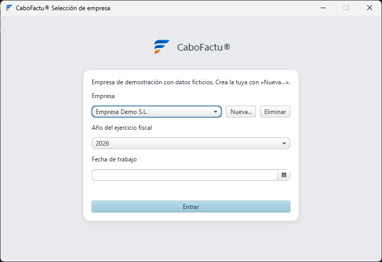
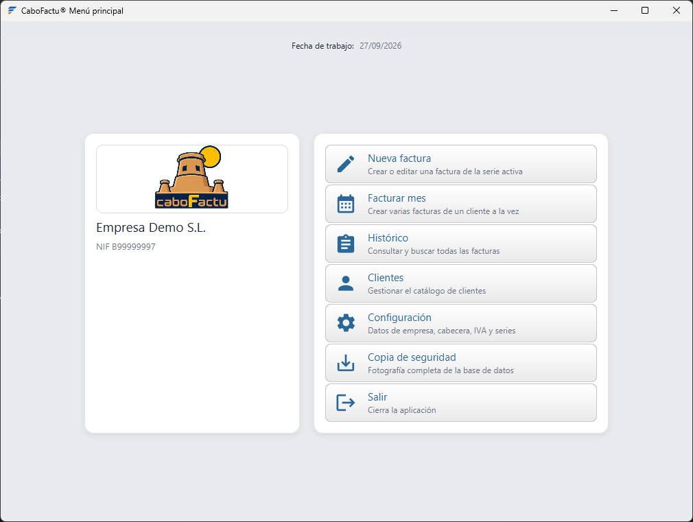
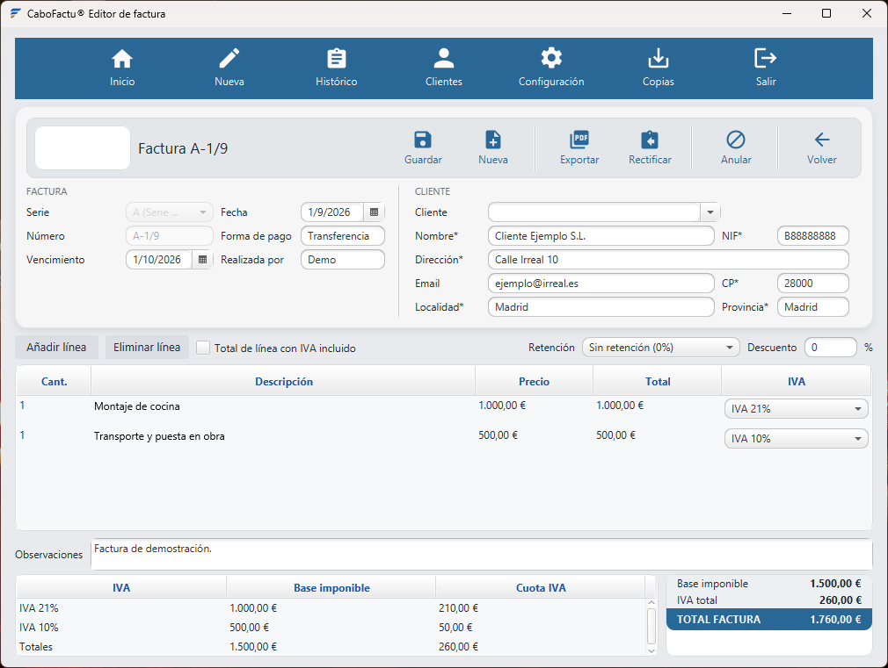
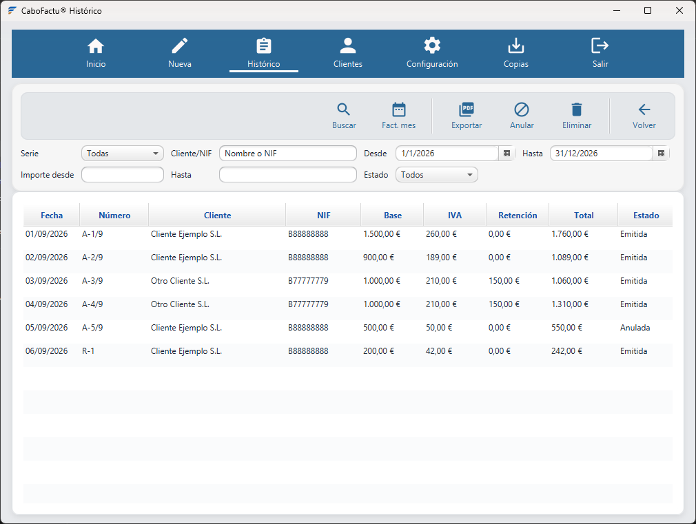
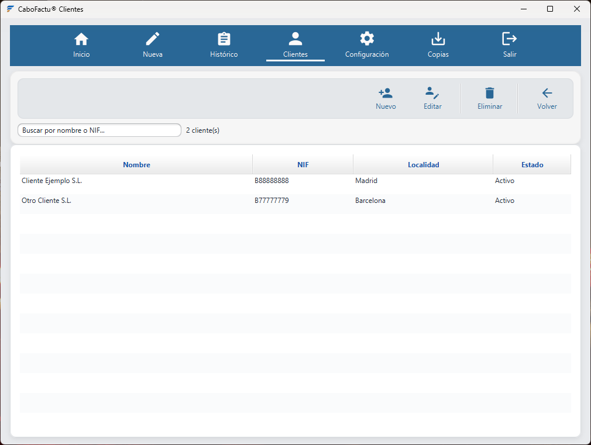
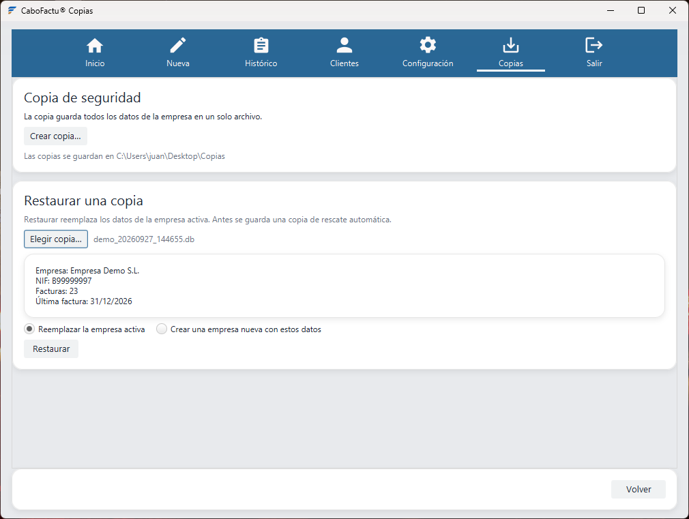
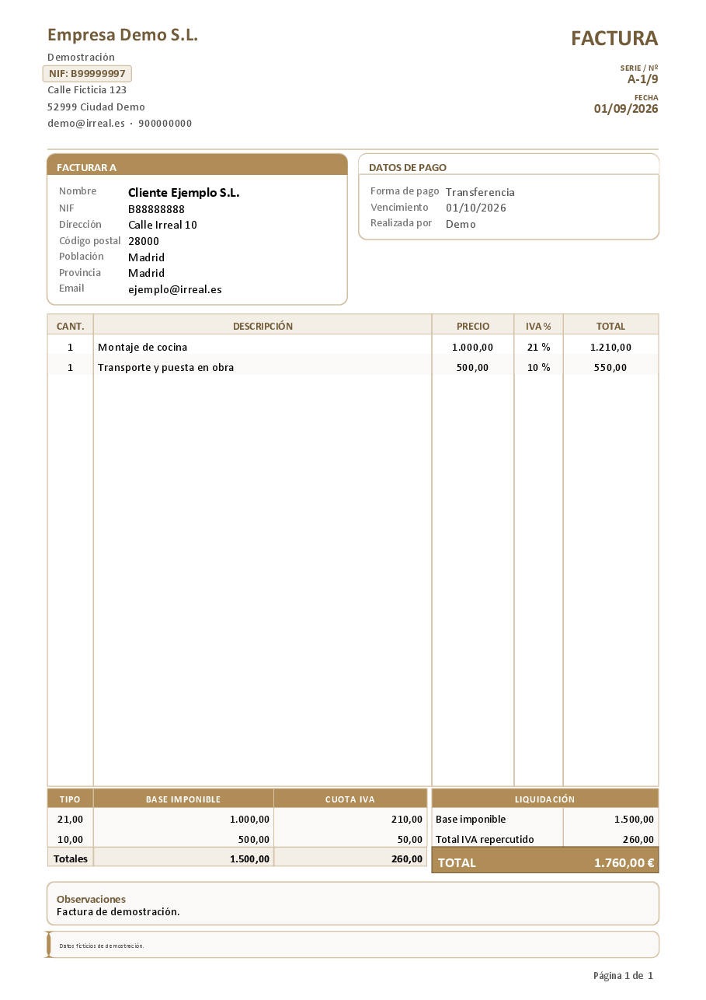
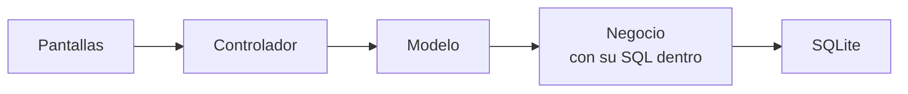

<div align="center">


# CaboFactu

**De una hoja de Excel a una aplicación de escritorio con base de datos: facturación real, con histórico y copias de seguridad.**


[Documentación técnica](docs/tecnico.md) · [Metodología](docs/metodologia.md) · [Flujos](docs/flujos.md) · [Diseño](docs/diseno.md) · [Especificación](openspec/specs/)

</div>

---

## Sobre el proyecto

Soy **[@jribanezgarcia](https://github.com/jribanezgarcia)**, estudiante de DAM.

**CaboFactu** nace de un problema real: una empresa llevaba toda su facturación en **una hoja de Excel**. Funcionaba, pero cada factura dependía de copiar la anterior, cambiar el número a mano y confiar en que ninguna fórmula se hubiera roto. Mi objetivo ha sido convertir ese proceso en **una aplicación de escritorio con persistencia en base de datos**, que haga lo mismo que la hoja pero sin sus riesgos.

### Antes y después

| | Con la hoja de Excel | Con CaboFactu |
|---|---|---|
| **Numeración** | Se escribía a mano: fácil repetir o saltarse un número | Correlativa por serie y por año, calculada por la aplicación, que avisa si un número ya existe |
| **Cálculos** | Fórmulas que se podían borrar o arrastrar mal | IVA, retención, descuento y suplidos calculados con `BigDecimal` y comprobados con tests |
| **Datos** | Un fichero por factura o una pestaña por mes | Una base de datos SQLite por empresa, con transacciones |
| **Correcciones** | Copiar la factura y retocarla | Rectificativas creadas desde la original, con la referencia automática |
| **Búsquedas** | Buscar a ojo entre ficheros | Histórico con filtros por serie, cliente, fechas, importes y estado |
| **PDF** | Exportar desde Excel cuidando que no se descuadrara | PDF generado con cabecera, logo, pie legal y color configurables |
| **Copias** | Copiar el fichero a mano (si alguien se acordaba) | Copia de seguridad con un botón y restauración con copia de rescate |
| **Varias empresas** | Una hoja distinta y a mezclar | Empresas con los datos totalmente separados |

## Qué hace

| | Funcionalidad |
|---|---|
| Facturas | Cliente, líneas, descuento general, varios tipos de IVA, retención de IRPF, suplidos y datos de pago. Una factura emitida se puede **editar, anular, restaurar y rectificar** |
| Numeración | Series con formato por mes, por año o sin sufijo, y correlativo independiente por ejercicio |
| Facturación mensual | Genera de golpe las facturas de un cliente para varios meses |
| Histórico | Filtros combinados y exportación |
| PDF | Exportación con cabecera de texto o logo, pie legal y color de acento |
| Empresas | Varias, con sus datos fiscales obligatorios antes de empezar |
| Copias de seguridad | Un botón, y restauración en la empresa activa o como empresa nueva |
| Apariencia | 7 temas: biblioteca8, omarchy, esmeralda, terracota, negro-dorado, sakura y Neón |
| Demostración | Empresa de datos ficticios con logo que se carga sola en una instalación nueva |

## Capturas

<table>
  <tr>
    <td align="center"><b>Pantalla de arranque</b><br/></td>
    <td align="center"><b>Menú principal</b><br/></td>
  </tr>
  <tr>
    <td align="center"><b>Editor de facturas</b><br/></td>
    <td align="center"><b>Histórico</b><br/></td>
  </tr>
  <tr>
    <td align="center"><b>Clientes</b><br/></td>
    <td align="center"><b>Copias de seguridad</b><br/></td>
  </tr>
  <tr>
    <td align="center" colspan="2"><b>PDF de una factura</b><br/></td>
  </tr>
</table>

## Diseño

Antes de programar cada pantalla la diseñé aparte, con maquetas en HTML: 41 maquetas entre el 20/08 y el 07/09, con las que elegí, corregí y descarté hasta dejar los 7 temas de color y una estructura inspirada en Ajustes de Apple.


El proceso completo, ronda a ronda, en **[docs/diseno.md](docs/diseno.md)**.

## Cómo está montado

La aplicación sigue un **MVC como el proyecto Biblioteca8**: el `Controlador` es la única puerta de las pantallas hacia los datos, y arranca y cierra la aplicación; el `Modelo` reúne todas las operaciones y sabe a qué clase de negocio le toca cada una. Las clases de `modelo/negocio` (`Facturas`, `Clientes`, `Series`...) son singletons que llevan dentro el SQL de sus propias tablas, sin capas de DAO ni de servicios. Por qué se reparten así, en [«Para qué sirven el Controlador y el Modelo»](docs/tecnico.md#para-qué-sirven-el-controlador-y-el-modelo).


```mermaid
flowchart LR
    A["Pantallas"] --> B["Controlador"] --> C["Modelo"] --> D["Negocio<br/>con su SQL dentro"] --> E["SQLite"]
```

Paquetes, modelo de datos y decisiones técnicas, en **[docs/tecnico.md](docs/tecnico.md)**.

## Cómo se ha hecho

Cada cambio se escribe antes de programarlo con **OpenSpec**: primero una ronda de preguntas y decisiones, después el `change` (por qué, cómo y los pasos), luego se implementa y se revisa, y al final la especificación de `openspec/specs/` se actualiza sola. Cómo se reparte el trabajo entre las herramientas de IA y yo, con un ejemplo real (`modulo-copias`) y la historia del proyecto por fases, en **[docs/metodologia.md](docs/metodologia.md)**. Dos recorridos por el código, clase a clase, en **[docs/flujos.md](docs/flujos.md)**.

## Cómo arrancarlo

**Requisitos:** JDK 21 · Maven 3.8+ · Windows

```bash
lanzar.bat          # script incluido
mvn javafx:run      # o con Maven
mvn test            # tests
```

Los datos se guardan en `%APPDATA%\Facturacion\`, con una base de datos SQLite por empresa.

En la primera ejecución se carga una **empresa de demostración** con datos ficticios. Para trabajar con tu empresa, créala desde la pantalla de arranque con «Nueva…» y completa sus datos fiscales en Configuración.

## Lo que he aprendido

- **MVC sencillo, sin capas de más.** Un singleton por entidad con su SQL dentro es menos código que repartir cada regla entre un servicio y un DAO, y sigue siendo fácil de leer.
- **Transacciones.** Guardar una factura toca varias tablas: o se guarda todo o no se guarda nada (`commit` / `rollback`).
- **Tests en tres capas.** 475 pruebas con JUnit 5 y TestFX que se pasan antes de dar cada cambio por bueno.
- **Escribir antes de programar.** Con OpenSpec cada cambio empieza por explicar *por qué* y *qué se descarta*, y la especificación se mantiene siempre al día.
- **Trabajar con IA revisándolo todo.** Las herramientas ayudan mucho, pero las decisiones y la revisión final son mías: en una auditoría temprana un modelo se inventó clases que no existían, y solo se detectó comprobándolo en el código.
- **Cambios pequeños.** Mejor muchos cambios pequeños y revisables que uno gigante imposible de probar.
- **Un error inesperado no debe pasar en silencio.** Un manejador global (`Thread.setDefaultUncaughtExceptionHandler`) avisa al usuario, deja la aplicación abierta y anota cada error en `errores.log`, en vez de dejarlo perdido en la consola.

## Próximos pasos

- [x] Reescritura módulo a módulo al estilo Biblioteca8
- [x] Documentación puesta al día
- [ ] Rama `pdf-jasper`: sustituir OpenPDF por JasperReports
- [ ] VeriFactu

---

<div align="center">

Hecho por **[@jribanezgarcia](https://github.com/jribanezgarcia)**


</div>
