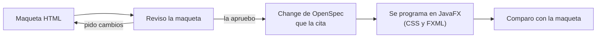
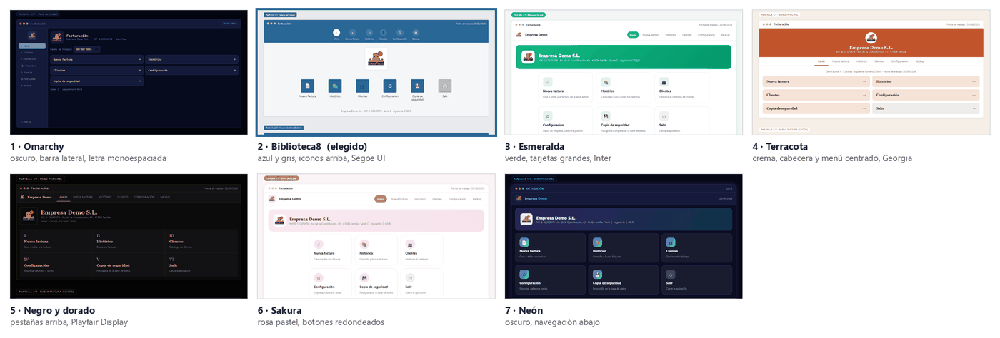
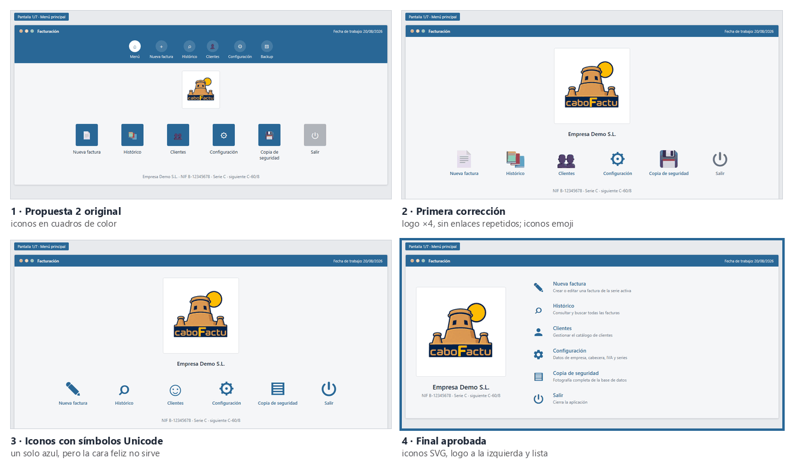
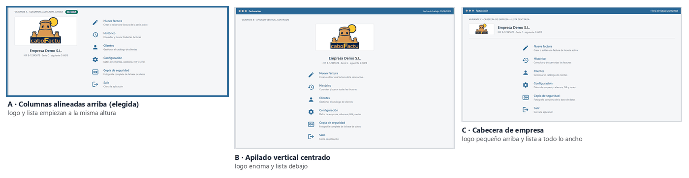
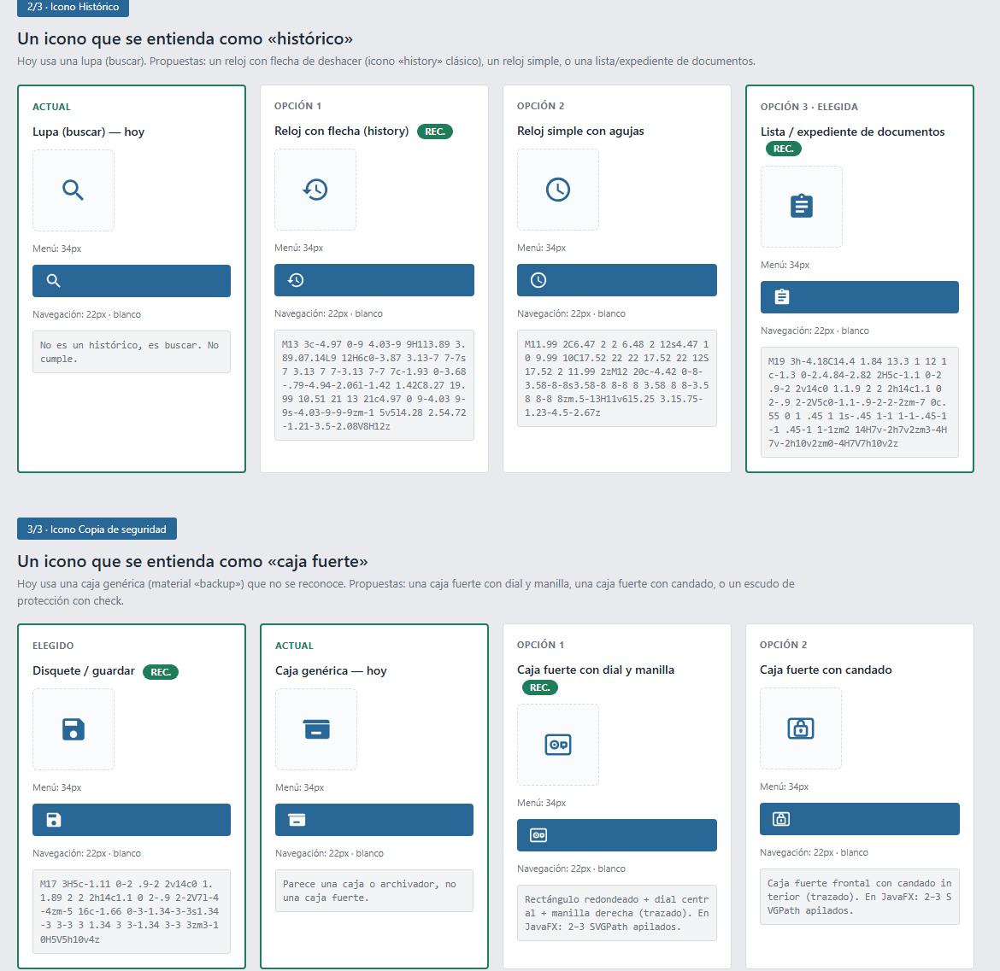
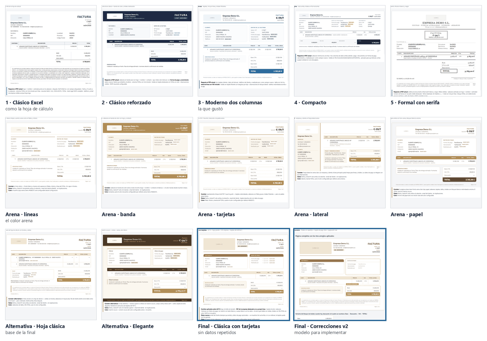
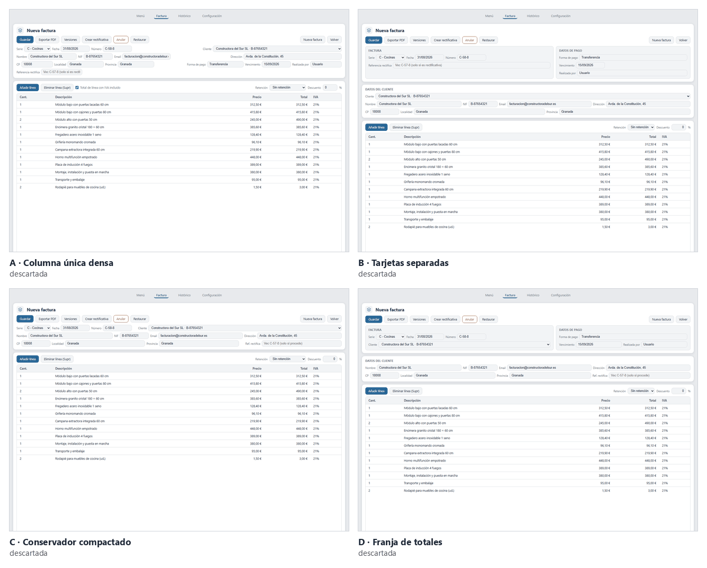
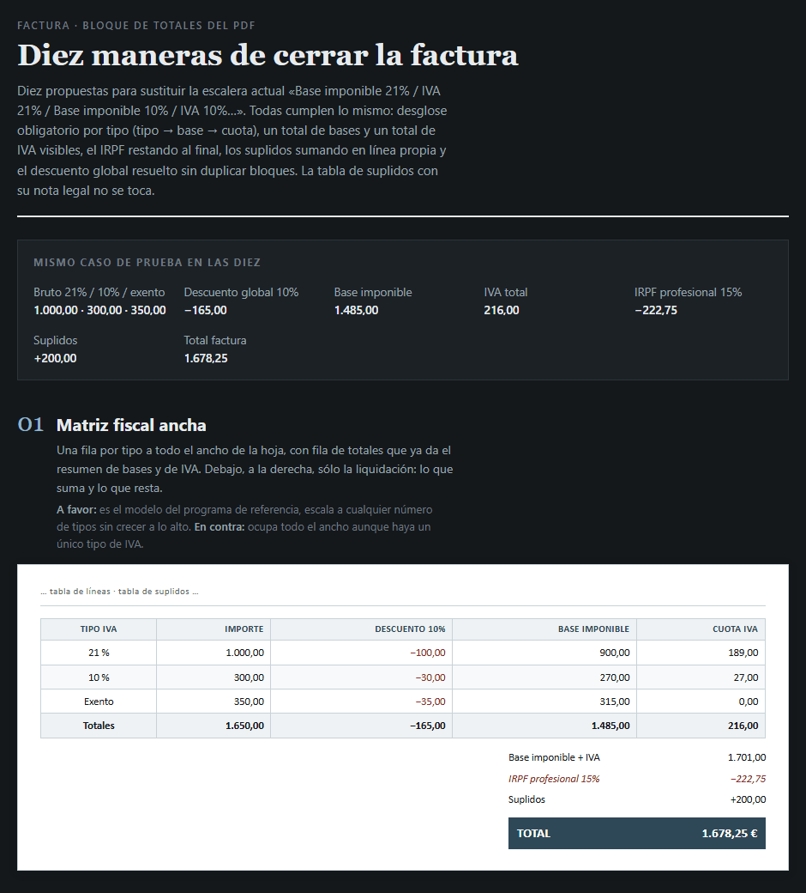
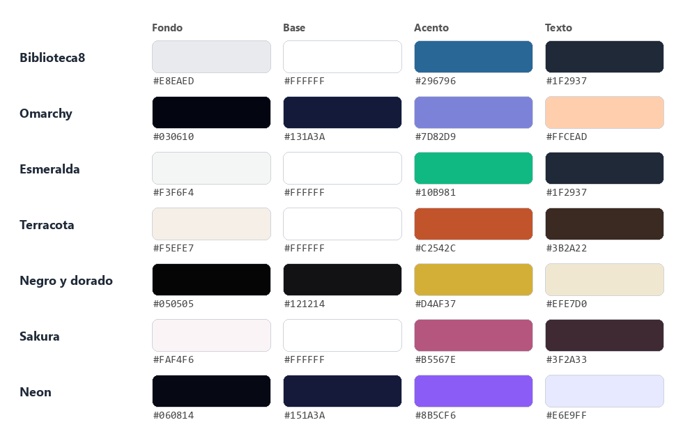

<div align="center">

# Diseño

**Cómo se diseñó el aspecto de CaboFactu, antes de programarlo**

[Volver al README](../README.md) · [Documentación técnica](tecnico.md) · [Metodología](metodologia.md) · [Flujos](flujos.md)

</div>

---

## Índice

1. [Cómo se trabajó el diseño](#cómo-se-trabajó-el-diseño)
2. [Las rondas](#las-rondas)
3. [Los iconos](#los-iconos)
4. [El resultado](#el-resultado)

---

## Cómo se trabajó el diseño

Antes de tocar una pantalla se hicieron maquetas: ficheros HTML autocontenidos que se abren con doble clic en el navegador, sin depender de la aplicación ni de Maven. El método fue siempre el mismo:



En total hice **41 maquetas entre el 20/08 y el 07/09**. La del menú principal, una vez elegida, pasó por **29 versiones en una tarde** hasta dejarla como la quería.

Las maquetas no están en el repositorio: usan el nombre, el logo y facturas reales de la empresa para la que se hizo la aplicación. La carpeta `prototipos/` está en `.gitignore`, y las imágenes de este documento están rehechas con los datos de la empresa de demostración.

### Changes que citan su maqueta

Cada maqueta aprobada se convirtió en un change de OpenSpec que la nombra. Esta es la relación entre unas y otros:

| Change | Maqueta |
|---|---|
| `alineacion-menu-e-iconos` | `ajustes-menu-iconos.html` |
| `redesign-pdf-factura` | `pdf-final-clasica-tarjetas.html` |
| `pdf-fidelidad-prototipo` | `pdf-fix-v2.html` |
| `fix-pdf-totales-tarjeta-pago` | `pdf-fix-v2.html` |
| `facturacion-mensual-cliente` | `generar-facturas-mensuales.html` |
| `desglose-totales-matriz-suplidos` | `02-editor.html`, `totales-desglose.html` |
| `pdf-desglose-rejilla-liquidacion` | `pdf-totales-r1-diez-propuestas.html`, `pdf-totales-rejilla-hermanas.html` |
| `pdf-cierre-anclado-al-pie` | `pdf-cierre-anclado-al-pie.html`, `pdf-multipagina-cliente-repetido.html` |
| `pdf-marco-relleno-y-pie-final` | `pdf-marco-y-pie-final.html` |
| `pdf-tabla-siempre-visible-y-tarjetas` | `pdf-cabecera-y-tarjetas.html` |

### Las herramientas

- **`javafx-design`**, una skill propia que creé el 20/08 imitando el flujo de Claude Design: maquetas HTML primero, código después. Vive fuera del proyecto, en `~/.config/opencode/skills/`. Sus reglas:
  - empezar por las pantallas reales (los FXML), no por la inspiración;
  - los colores como variables, una paleta por propuesta sobre la misma estructura;
  - cada maqueta, un HTML autocontenido con datos realistas (importes como `1.250,50 €`, fechas como `11/08/2026`);
  - iterar conmigo y programar solo lo aprobado;
  - las maquetas se quedan en `prototipos/`, sin dejar documentación ni rastro de IA en el proyecto;
  - las paletas de Omarchy y de Biblioteca8, ya apuntadas como referencia.
- **`apple-design`**, de Emil Kowalski ([github.com/emilkowalski/skills](https://github.com/emilkowalski/skills)). El 24/08 pedí aplicarla para rediseñar la aplicación, y de ahí salió el change `redesign-ui-apple` (31/08): tarjetas, bordes redondeados, espacio y jerarquía, con las mismas paletas.
- **Claude Design**: con ella hice el editor definitivo, después de descartar las cuatro variantes de la ronda 6.

La IA propone y hace las maquetas; yo elijo, corrijo y descarto. Los ejemplos concretos están en las rondas siguientes.

## Las rondas

### 1. Temas (20/08)



Pedí 7 propuestas, cada una con las 7 pantallas de la aplicación (49 pantallas en total). Cada propuesta cambiaba a la vez la paleta, el sitio del menú, la letra y la forma de los controles, para poder combinar después «los colores de una y la distribución de otra»:

| Propuesta | Paleta | Menú | Letra |
|---|---|---|---|
| 1 Omarchy | oscuro, azul noche y lavanda | barra lateral | monoespaciada |
| 2 Biblioteca8 | azul y gris | iconos arriba | Segoe UI |
| 3 Esmeralda | blanco y verde | tarjetas grandes | Inter |
| 4 Terracota | crema y terracota | cabecera y menú centrado | Georgia |
| 5 Negro y dorado | negro y dorado | pestañas arriba | Playfair Display |
| 6 Sakura | rosa pastel | botones redondeados a la derecha | Segoe UI |
| 7 Neón | oscuro, violeta y cian | barra abajo | Segoe UI |

Elegí la 2, Biblioteca8. Las otras seis no se descartaron del todo: se quedaron como los temas de color que hoy se pueden elegir en Configuración. De ahí salen los 7 temas de la aplicación.

### 2. La elegida, afinada (20/08)



Sobre `tema-02-final.html` pedí 29 versiones hasta dejarlo como quería. Entre lo que pedí:

- el logo cuatro veces más grande en el menú y el doble en el editor;
- sin enlaces repetidos en el menú principal;
- «Salir» en todas las pantallas, con confirmación;
- todos los iconos de un mismo color (azul en el menú, blancos sobre la barra azul);
- la cara feliz de «Clientes» sustituida por la silueta de una persona;
- un engranaje más relleno;
- un texto de ayuda al pasar el ratón por cada icono;
- los botones de la barra de acciones en gris;
- el logo a la izquierda con la lista de opciones a la derecha.

### 3. Menú e iconos (20/08)




Sobre `ajustes-menu-iconos.html`:

- **Alineación del menú**: tres variantes (A columnas alineadas arriba, B apilado vertical centrado, C cabecera de empresa). Elegí la A.
- **Icono del Histórico**: partí de una lupa y probé tres opciones. La recomendada era un reloj con flecha; **elegí la 3, la lista de documentos**.
- **Icono de la copia de seguridad**: probé varias opciones (disquete, caja fuerte con dial, con candado, escudo). Se eligió el disquete y después pedí que llevara una flecha. El icono de hoy, comprobado en `MenuPrincipal.fxml`, es una bandeja con una flecha entrando desde arriba.
- Ese mismo día, al ejecutar la aplicación vi que el logo no estaba donde había pedido. De ahí sale la costumbre de comparar siempre la aplicación con la maqueta antes de dar un cambio por bueno.

### 4. El PDF (21-22/08)



Pedí cinco propuestas y me gustó la 3, moderna a dos columnas. Después pedí un color arena claro, configurable desde la aplicación, y salieron cinco propuestas más en ese tono; de ahí, dos alternativas.

La final, `pdf-final-clasica-tarjetas`, parte de la alternativa «hoja clásica», sin datos repetidos: la fecha y el número solo aparecen arriba a la derecha, con la serie y el número.

Con `pdf-fix-v2` como modelo, el change `pdf-fidelidad-prototipo` ajustó espaciados, bordes redondeados, letra y colores hasta que el PDF quedó igual que la maqueta.

El resultado de hoy, en [`capturas/pdf.png`](capturas/pdf.png).

### 5. La estructura, al estilo Apple (24-31/08)

Con la skill `apple-design` pedí rediseñar la estructura de la aplicación entera, lo que dio los changes `redesign-ui-apple` y `fix-ui-spacing`. Las maquetas de esta ronda fueron `02-editor.html`, `04-configuracion.html` y `generar-facturas-mensuales.html` (31/08).

### 6. El editor a 1024×768 (01/09)



Pedí cuatro variantes para que la factura cupiera entera sin barra de desplazamiento: A columna única densa, B tarjetas separadas, C conservador compactado y D franja de totales.

**Las descarté todas**: el editor definitivo lo hice en Claude Design.

El resultado de hoy, en [`capturas/editor.png`](capturas/editor.png).

### 7. Los totales del PDF (06-07/09)



Empecé por `totales-desglose.html`, seguí con «Diez maneras de cerrar la factura» (`pdf-totales-r1-diez-propuestas.html`) y dos rondas más (`r2-variantes`, `r3-rejilla`), hasta `pdf-totales-rejilla-hermanas.html`, que dio el change `pdf-desglose-rejilla-liquidacion`.

El 07/09 hice cuatro maquetas más para el final de la hoja: `pdf-cierre-anclado-al-pie`, `pdf-multipagina-cliente-repetido`, `pdf-marco-y-pie-final` y `pdf-cabecera-y-tarjetas`.

Hubo otras maquetas más pequeñas, como `colores-historico-clientes.html` (03/09), que dio el change `ajuste-colores-historico-clientes-editor`.

## Los iconos

En `proceso-final.png` se ve cómo llegué al icono en SVG: primero probé emojis de colores, después símbolos Unicode de un solo color (✎ ⌕ ☺ ⚙), y al final dibujos SVG.

**Por qué SVG**:

- los emojis traen su propio color y no se pueden pintar con el del tema;
- los símbolos Unicode dependen de la fuente de cada equipo y se ven distintos de un ordenador a otro;
- un SVG es un trazado: toma cualquier color, escala sin pixelarse y no necesita ficheros de imagen aparte.

**De dónde salen**: los trazados son los de los iconos de Material Design de Google, en una rejilla de 24×24 y con licencia libre (Apache 2.0). Por ejemplo, `history`, `settings`, `save_alt`, `info` o `warning`.

**Cómo están en el código**:

- un `SVGPath` dentro del FXML, con su trazado en `content`. Así está el icono de Clientes en `MenuPrincipal.fxml`:

  ```xml
  <SVGPath styleClass="icono" content="M12 12c2.21 0 4-1.79 4-4s-1.79-4-4-4-4 1.79-4 4 1.79 4 4 4zm0 2c-2.67 0-8 1.34-8 4v2h16v-2c0-2.66-5.33-4-8-4z"/>
  ```

- el color viene del tema: cada `tema-*.css` trae una regla como `.opcion-menu .icono { -fx-fill: #296796; }`, así que los iconos cambian de color solos al cambiar de tema;
- en la barra de navegación (`BarraNavegacion.fxml`) cada icono va en una caja fija de 26×26 (`StackPane`), para que los siete textos queden a la misma altura;
- los diálogos de aviso (`Dialogos`) llevan también su icono en `SVGPath`.

**La excepción**: el icono de la aplicación (`icono-aplicacion.png`) es una imagen, porque Windows lo pide así para la barra de tareas.

## El resultado



| Tema | Tipo | Fondo | Base | Acento | Texto | Letra |
|---|---|---|---|---|---|---|
| Biblioteca8 | claro | `#E8EAED` | `#FFFFFF` | `#296796` | `#1F2937` | Segoe UI |
| Omarchy | oscuro | `#030610` | `#131A3A` | `#7D82D9` | `#FFCEAD` | Cascadia Mono |
| Esmeralda | claro | `#F3F6F4` | `#FFFFFF` | `#10B981` | `#1F2937` | Segoe UI |
| Terracota | claro | `#F5EFE7` | `#FFFFFF` | `#C2542C` | `#3B2A22` | Georgia |
| Negro y dorado | oscuro | `#050505` | `#121214` | `#D4AF37` | `#EFE7D0` | Segoe UI |
| Sakura | claro | `#FAF4F6` | `#FFFFFF` | `#B5567E` | `#3F2A33` | Segoe UI |
| Neón | oscuro | `#060814` | `#151A3A` | `#8B5CF6` | `#E6E9FF` | Segoe UI |

Cada empresa guarda su propio tema, y lo copiamos a las preferencias globales para que la pantalla de arranque salga con el último elegido.

**Cómo funcionan los temas**: cada pantalla carga dos hojas de estilos, `base.css` (la estructura común, igual para todos) y `tema-<nombre>.css` (solo colores), juntadas por `GestorTemas.hojas()`. El estilo de JavaFX calcula los colores de sus propios controles (botones, campos, tablas) a partir de unas pocas variables del `.root`, como `-fx-base` o `-fx-accent`, así que basta con cambiar esas variables para que todos se tiñan solos. Las piezas propias de CaboFactu, como los iconos del menú, llevan su color aparte en cada tema.

**Cómo se añade un tema nuevo**, en cuatro pasos:

1. copiar un `tema-*.css` y cambiarle los colores;
2. añadir una línea en `GestorTemas`;
3. pasar `TemasTest`;
4. mirarlo a mano en la aplicación.

**Cómo se vigila que no se rompa**:

- `TemasTest` comprueba que cada tema define su paleta completa;
- `TextosCompletosTest` comprueba que, con la ventana en su tamaño mínimo (1024×768), ningún texto se corta;
- a mano, reviso el aspecto de cada pantalla y del PDF.

Errores de diseño que ya se corrigieron por el camino, sacados de «Trampas conocidas» de [`ESTADO.md`](../ESTADO.md): colores fijos en `base.css` que dejaban ilegibles los temas oscuros, una clase CSS propia (`menu-item`) que chocaba con una de JavaFX, un `.root` sin el punto delante que tiraba la paleta entera, y un texto de ayuda que no se leía en los temas oscuros.

---

<div align="center">

[Volver al README](../README.md) · [Documentación técnica](tecnico.md) · [Metodología](metodologia.md) · [Flujos](flujos.md)

</div>
