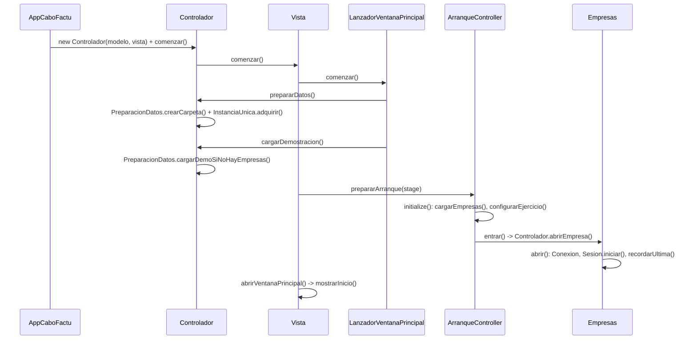
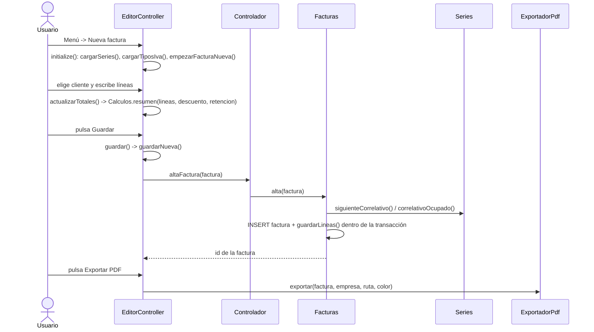

# Flujos

**Dos recorridos por el código, clase a clase**

[Volver al README](../README.md) · [Metodología](metodologia.md) · [Documentación técnica](tecnico.md)

---

## Índice

1. [Primer arranque](#primer-arranque)
2. [De la empresa abierta a la factura en PDF](#de-la-empresa-abierta-a-la-factura-en-pdf)

Todos los métodos citados existen tal cual en el código de hoy (comprobados con `grep` antes de escribirlos), no se han simplificado ni renombrado para el ejemplo.

---

## Primer arranque

Sin ninguna empresa todavía en `%APPDATA%\Facturacion`.

1. **[`AppCaboFactu.main`](../src/main/java/cabofactu/AppCaboFactu.java)**: fija el idioma a español, crea [`Modelo`](../src/main/java/cabofactu/modelo/Modelo.java), pide `Vista.getInstancia()`, crea el [`Controlador`](../src/main/java/cabofactu/controlador/Controlador.java) con ambos y llama a `controlador.comenzar()`.
2. **`Controlador.comenzar`** llama a [`Vista`](../src/main/java/cabofactu/vista/Vista.java)`.comenzar`, que llama a [`LanzadorVentanaPrincipal`](../src/main/java/cabofactu/vista/LanzadorVentanaPrincipal.java)`.comenzar`: arranca JavaFX (`Application.launch`), que a su vez invoca `start(Stage)`.
3. **`LanzadorVentanaPrincipal.start`** pide al controlador `prepararDatos()`. Dentro, `Controlador.prepararDatos` llama a [`PreparacionDatos`](../src/main/java/cabofactu/PreparacionDatos.java)`.crearCarpeta()` (crea `%APPDATA%\Facturacion` si no existe) y a [`InstanciaUnica`](../src/main/java/cabofactu/InstanciaUnica.java)`.adquirir()`, que intenta bloquear `facturas.lock`; si otra instancia ya lo tiene bloqueado, se lanza una `Exception` y la aplicación se cierra con un aviso.
4. **`LanzadorVentanaPrincipal.start`** llama después a `controlador.cargarDemostracion()`, que reenvía a `PreparacionDatos.cargarDemoSiNoHayEmpresas`: si [`Empresas`](../src/main/java/cabofactu/modelo/negocio/Empresas.java)`.getEmpresas().listado()` está vacío, llama a [`CargarDemo`](../src/main/java/cabofactu/modelo/negocio/sqlite/CargarDemo.java)`.cargar()`, que da de alta la empresa `demo` con `Empresas.alta("Demo")` y ejecuta `db/seed_demo.sql` sobre la base recién creada con [`Conexion`](../src/main/java/cabofactu/modelo/negocio/sqlite/Conexion.java)`.establecerConexion()`.
5. **`Vista.prepararArranque`** carga `Arranque.fxml` en la ventana y devuelve su [`ArranqueController`](../src/main/java/cabofactu/vista/controlador/ArranqueController.java). Al mostrarse, `stage.setOnShown` llama a `arranque.mostrarAvisoInicial(demoCargada)`, que avisa de la demo si se acaba de cargar.
6. **`ArranqueController.initialize`** (llamado por JavaFX al cargar el FXML) rellena el combo de empresas (`cargarEmpresas`) y el de ejercicios fiscales (`configurarEjercicio`), y fija la fecha de trabajo a hoy si el ejercicio elegido es el actual.
7. El usuario elige empresa y pulsa **Entrar**: `ArranqueController.entrar` valida que hay empresa y fecha, y llama a `Controlador.abrirEmpresa(carpeta, fecha)`, que reenvía a `Modelo` y termina en `Empresas.abrir`.
8. **`Empresas.abrir`** activa la carpeta de datos (`Conexion.setEmpresaActiva`), abre la conexión, llama a [`Sesion`](../src/main/java/cabofactu/modelo/negocio/Sesion.java)`.getSesion().iniciar(carpeta, fecha)` (guarda la fecha de trabajo de la sesión), recuerda la empresa elegida (`recordarUltima`) y el tema (`recordarTema`).
9. **`ArranqueController.entrar`** llama a `Vista.abrirVentanaPrincipal()` y cierra la ventana de arranque.
10. **`Vista.abrirVentanaPrincipal`** abre la ventana principal y llama a `mostrarInicio()`: si `Controlador.buscarEmpresa()` devuelve una empresa con sus datos completos, muestra `MenuPrincipal.fxml`; si no, muestra `Configuracion.fxml` bloqueada.
11. **[`MenuPrincipalController`](../src/main/java/cabofactu/vista/controlador/MenuPrincipalController.java)`.initialize`** carga el nombre, el NIF y el logo de la empresa activa, y la fecha de trabajo de la sesión.
12. Al cerrar la ventana, `Vista` pide confirmación (`puedeSalir`) y llama a `Controlador.terminar()`, que suelta el bloqueo de `InstanciaUnica` y cierra la conexión con `Conexion.cerrarConexion()`.

**Conceptos que aparecen**: patrón *singleton* (`Vista`, `Empresas`, `Sesion`), MVC con `Controlador`/`Modelo`/`Vista`, `Initializable.initialize()` de JavaFX, bloqueo de fichero (`FileLock`) para instancia única, y la separación entre `alMostrar()` (después de que la pantalla ya está en la ventana) e `initialize()` (mientras se carga el FXML).

---

## De la empresa abierta a la factura en PDF

Con una empresa ya abierta y sesión iniciada (fecha de trabajo fijada).

1. Desde el menú, **«Nueva factura»**: `Vista.mostrar("Editor.fxml")` carga la pantalla y JavaFX llama a [`EditorController`](../src/main/java/cabofactu/vista/controlador/EditorController.java)`.initialize`, que en orden carga el logo, las series (`cargarSeries`), la fecha inicial, los tipos de IVA y retención, prepara la tabla de líneas y llama a `empezarFacturaNueva()`.
2. El usuario elige el **cliente**: el buscador (`prepararBuscadorCliente` / `buscarClientes`) llama a `Controlador.listadoClientes(texto, soloActivos)`, y al elegir uno se copian sus datos a los campos `cliNombre`, `cliNif`... del editor.
3. El usuario escribe las **líneas** en `tablaLineas`: cada celda (las clases internas de `EditorController` que extienden `CeldaTexto`) valida lo que se escribe y actualiza el objeto [`LineaFactura`](../src/main/java/cabofactu/modelo/dominio/LineaFactura.java) correspondiente, que se valida solo en sus setters. Cada cambio dispara `actualizarTotales()`, que llama a [`Calculos`](../src/main/java/cabofactu/modelo/negocio/Calculos.java)`.resumen(lineas, descuento, retencionActual)` para recalcular base, IVA, retención y total.
4. El usuario pulsa **Guardar**: `EditorController.guardar` comprueba el cliente (`comprobarCliente`), la fecha (`comprobarFecha`) y que haya al menos una línea con contenido; si la factura es nueva, llama a `guardarNueva(cliente, dia, guardables)`.
5. **`guardarNueva`** arma un objeto [`Factura`](../src/main/java/cabofactu/modelo/dominio/Factura.java) con `new Factura(serie, dia, cliente)`, le pone las líneas y llama a `Controlador.altaFactura(nueva)`, que reenvía a `Modelo.altaFactura` y termina en **[`Facturas`](../src/main/java/cabofactu/modelo/negocio/Facturas.java)`.alta`**.
6. Dentro de **`Facturas.alta`**: abre la conexión, fija `setAutoCommit(false)` y llama al privado `insertar(factura)`, que calcula el correlativo con [`Series`](../src/main/java/cabofactu/modelo/negocio/Series.java)`.getSeries().siguienteCorrelativo(serie, fecha)` si no venía fijado, comprueba que no esté ocupado (`correlativoOcupado`), inserta la fila en `factura` con `INSERT INTO factura (...)` y llama a `guardarLineas(id, lineas)` para las filas de `factura_linea`. Si todo va bien, `commit()`; si algo falla, `revertir(conexion)` (`rollback`) antes de relanzar la excepción.
7. El editor recibe el `id` de la factura guardada, recarga la ficha con `cargarFactura(id)` y avisa con [`Dialogos`](../src/main/java/cabofactu/vista/utilidades/Dialogos.java)`.mostrarDialogoInformacion`.
8. El usuario pulsa **Exportar PDF**: `EditorController.exportarPdf` vuelve a buscar la factura y la empresa, propone una ruta de destino, abre un `FileChooser` y, si el usuario confirma, llama a `new` [`ExportadorPdf`](../src/main/java/cabofactu/pdf/ExportadorPdf.java)`().exportar(factura, empresa, ruta, color)`.

**Hasta aquí**: lo que pasa dentro del paquete `pdf` (cómo se construye el documento con OpenPDF) no se detalla, porque se va a sustituir por JasperReports en la rama `pdf-jasper`; este documento se actualizará entonces.

**Conceptos que aparecen**: MVC con reenvío `Controlador` → `Modelo` → negocio, transacción (`setAutoCommit` / `commit` / `rollback`), clase de datos que se valida en sus setters (`LineaFactura`), celdas de tabla explicadas dentro del propio controlador (`CeldaTexto`), y `FileChooser` de JavaFX para elegir dónde guardar el PDF.

---

[Volver al README](../README.md) · [Metodología](metodologia.md) · [Documentación técnica](tecnico.md)

