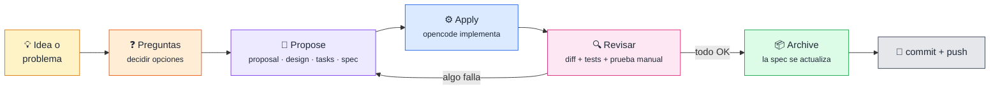

<div align="center">

# 🧭 Metodología

**Cómo se desarrolla CaboFactu con opencode y OpenSpec**

[⬅️ Volver al README](../README.md) · [📐 Documentación técnica](tecnico.md)

</div>

---

## 📑 Índice

1. [🔁 El ciclo de un cambio](#-el-ciclo-de-un-cambio)
2. [👥 Quién hace qué](#-quién-hace-qué)
3. [📂 Qué hay en un change](#-qué-hay-en-un-change)
4. [🕰️ Ejemplo real: reloj-inyectable](#️-ejemplo-real-reloj-inyectable)
5. [🔍 Auditoría de la arquitectura con IA](#-auditoría-de-la-arquitectura-con-ia)

---

## 🔁 El ciclo de un cambio

Cada cambio, por pequeño que sea, sigue **el mismo ciclo**. Así nunca se programa «a ciegas» y queda escrito por qué se hizo cada cosa.



> [!TIP]
> **💡 Concepto: spec.** Una *especificación* describe **qué debe hacer** la aplicación, con requisitos y escenarios del tipo «**cuando** el usuario hace X, **entonces** pasa Y». Está en [`openspec/specs/`](../openspec/specs/) y se actualiza sola al archivar cada cambio, así que siempre refleja cómo funciona la aplicación de verdad.

---

## 👥 Quién hace qué

| Paso | Quién | Qué se hace |
|---|---|---|
| ❓ **Preguntas** | Yo + **Claude Code** | Antes de escribir nada, rondas de preguntas con las opciones explicadas y una recomendada. **La decisión es mía.** |
| 📝 **Propose** | **Claude Code** | Crea la carpeta del cambio en `openspec/changes/<nombre>/` con las decisiones tomadas |
| ⚙️ **Apply** | **opencode** | `/opsx-apply <nombre>` implementa las tareas y ejecuta los tests |
| 🔍 **Revisar** | Yo + **Claude Code** | Se revisa el diff, se pasa `mvn test` de nuevo y hago las pruebas manuales en la aplicación |
| 📦 **Archive** | **opencode** | `/opsx-archive <nombre>` mueve el cambio a `openspec/changes/archive/` y actualiza la spec |

> [!NOTE]
> **Qué hago yo y qué hace la IA.** Las herramientas me ayudan a proponer, escribir y revisar código, pero **las decisiones son mías**: qué se cambia, qué opción se elige, qué se descarta y cuándo un cambio está bien. Varias propuestas se han rechazado o simplificado por eso, por ejemplo un estado «Borrador» que decidí no implementar todavía, o un diseño con clases intermedias que cambié por uno más sencillo.

---

## 📂 Qué hay en un change

```text
openspec/changes/2026-09-13-reloj-inyectable/
├── .openspec.yaml   → metadatos (fecha, si modifica la spec o no)
├── proposal.md      → 🤔 POR QUÉ: el problema y qué va a cambiar
├── design.md        → 🛠️ CÓMO: decisiones D1, D2… con las alternativas descartadas
├── tasks.md         → ✅ PASOS: tareas concretas con rutas de ficheros, incluidas las pruebas manuales
└── specs/…          → 📚 solo si cambia el comportamiento visible
```

---

## 🕰️ Ejemplo real: reloj-inyectable

Un cambio pequeño y completo, tal como se hizo.

### 🤔 El problema (`proposal.md`)

La fecha actual se leía con `LocalDate.now()` **dentro** de las reglas de negocio: cinco veces en `NumeroService` para decidir el año de la numeración, dos en `VersionadoService` para sellar la hora de guardado, y otras en las pantallas. Además, la regla «fecha de trabajo o, si no hay, hoy» estaba **copiada en cuatro pantallas**.

Consecuencia: **no se podía probar** la numeración de otro año, porque los tests siempre usaban el día en que se ejecutaban.

### 🛠️ Las decisiones (`design.md`)

| # | Decisión | Descartado | Por qué |
|---|---|---|---|
| D1 | Los servicios reciben un `java.time.Clock` por constructor | Una interfaz propia `ProveedorFecha` | `Clock` ya existe en Java y tiene `Clock.fixed(...)` para tests |
| D2 | El año del contador de una serie nueva lo decide el servicio, no el repositorio | Dejar `now()` en el repositorio | El DAO no debe conocer la fecha actual |
| D3 | Clase `Reloj` con `hoy()`, `ahora()` y `fechaTrabajo()` para las pantallas | Repetir la regla en cada pantalla | Una sola fuente para la fecha de trabajo |
| D4 | `Servicios(Clock)` crea un único reloj y lo reparte | Un reloj por servicio | Todos los servicios ven la misma hora |
| D5 | La pantalla de arranque queda fuera | Tocarla también | Se muestra antes de que existan los servicios y no numera nada |

También se decidió **partir el cambio en dos**: el reloj por un lado y las excepciones por otro, porque juntos daban un diff enorme e imposible de revisar bien.

### ✅ Las tareas y la verificación (`tasks.md`)

```java
Clock fijo = Clock.fixed(Instant.parse("2031-06-15T10:00:00Z"), ZoneId.of("Europe/Madrid"));
```

- 🧪 **Tests nuevos con la fecha fijada en 2031**: la numeración sin fecha usa el contador de 2031, y la versión se sella con `2031-06-15T12:00` (hora de Madrid).
- 🔎 **Búsquedas de control**: ningún `now()` sin reloj en servicios ni repositorios.
- 🟢 **`mvn test`**: 220 tests en verde.
- 🖱️ **Pruebas manuales**: arrancar con una fecha de trabajo de otro año y comprobar menú, editor, rectificativa y series; crear una copia de seguridad y comprobar que el nombre del fichero lleva la fecha y hora reales.

> [!TIP]
> **💡 Concepto: inyectar una dependencia.** En vez de que la clase «vaya a buscar» la hora (`LocalDate.now()`), **se la dan** al crearla (`new NumeroService(…, clock)`). En la aplicación se le pasa el reloj real y en los tests uno parado en la fecha que interese.

---

## 🔍 Auditoría de la arquitectura con IA

Antes de seguir añadiendo funciones se hizo una **auditoría** del código para detectar problemas de diseño típicos de un proyecto hecho con ayuda de IA.

### Qué se revisó

| Bloque | Preguntas |
|---|---|
| 🧩 **Dependencias** | ¿Las clases crean lo que necesitan o se lo dan? ¿Hay un único sitio que monta todo? ¿Se cuela SQL en pantallas o servicios? ¿Hay clases gigantes o dependencias circulares? |
| 🧾 **VeriFactu** | ¿Se pueden modificar o borrar facturas emitidas? ¿Hay registro con huella? ¿Faltan datos fiscales? ¿Hay un único punto de emisión? |

### Cómo se hizo

1. 🧪 **Probar el modelo antes de fiarse de él.** Se hizo una pregunta de control sobre una clase concreta. Un modelo (Nemotron 3 Ultra) **se inventó cinco clases** que no existían (`SerieService`, `ClienteService`…), porque dedujo los tipos por el nombre de los campos. Otro (Muse Spark 1.3) respondió bien citando fichero y línea, y fue el elegido.
2. 📄 **Informe por bloques** guardado en ficheros, con cada hallazgo en formato `fichero:línea | gravedad | problema | arreglo`.
3. ✔️ **Verificar cada hallazgo grave en el código real** antes de creerlo. Así se corrigieron recuentos de líneas mal hechos y se encontró algo que el informe no vio: que no existía el estado «Borrador».
4. 📋 **Convertir lo confirmado en una cola de cambios pequeños**, ordenados de menos a más riesgo.

### Qué salió de ahí

| Hallazgo | Cambio |
|---|---|
| Las pantallas usaban los DAO directamente | ✅ `capa-servicios-catalogos` |
| `LocalDate.now()` repartido por las reglas | ✅ `reloj-inyectable` |
| `SQLException` llegaba hasta las pantallas | ✅ `excepcion-de-datos` |
| Empresa creada con un nombre fijo y sin datos fiscales | ✅ `empresa-inicial-obligatoria` |
| `Main` con demasiadas responsabilidades | ✅ `main-delgado` |
| SQL dentro de pantallas y servicios de copias | ✅ `sql-fuera-de-ui-y-service` |
| Emisión repartida, sin registro ni datos fiscales | ⏳ [Preparación para VeriFactu](tecnico.md#-preparación-para-verifactu) |

> [!IMPORTANT]
> **La lección:** la IA es muy útil para revisar mucho código rápido, pero **se equivoca con total seguridad**. Cada hallazgo hay que comprobarlo en el código antes de actuar.

---

<div align="center">

[⬅️ Volver al README](../README.md) · [📐 Documentación técnica](tecnico.md)

</div>
