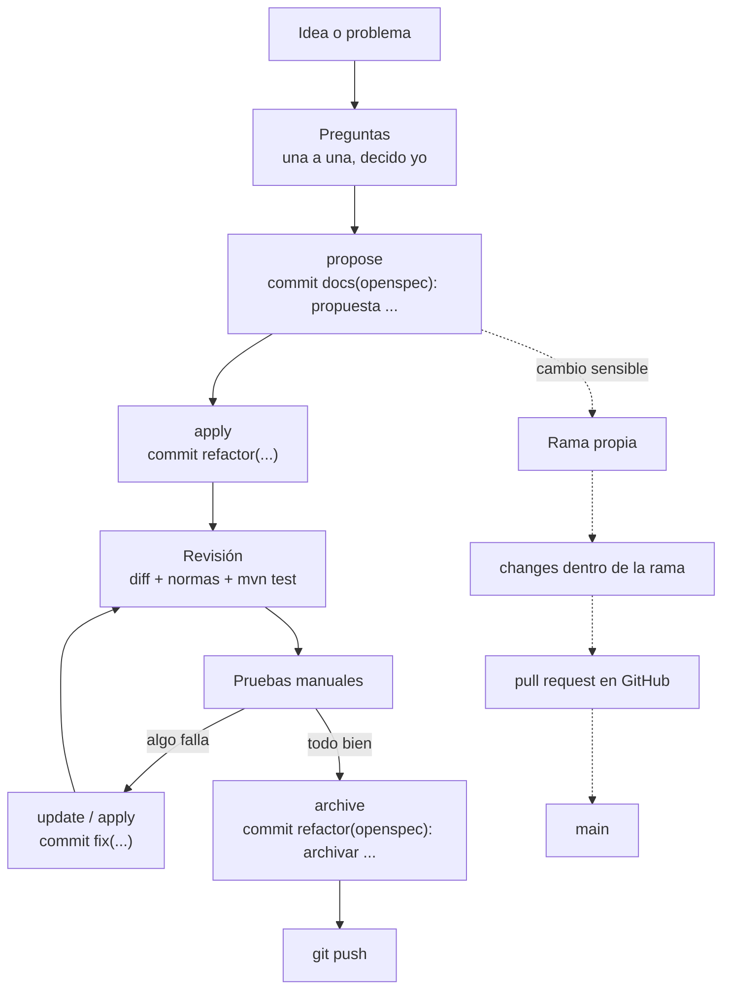

<div align="center">

# Metodología

**Cómo se ha hecho CaboFactu con OpenSpec**

[Volver al README](../README.md) · [Documentación técnica](tecnico.md) · [Flujos](flujos.md)

</div>

---

## Índice

1. [Qué es OpenSpec](#qué-es-openspec)
2. [Las carpetas de OpenSpec](#las-carpetas-de-openspec)
3. [Los comandos y qué hacen](#los-comandos-y-qué-hacen)
4. [Cómo lo hacemos aquí](#cómo-lo-hacemos-aquí)
5. [El flujo completo de un change](#el-flujo-completo-de-un-change)
6. [Commits y ramas](#commits-y-ramas)
7. [Ejemplo real: modulo-copias](#ejemplo-real-modulo-copias)
8. [Historia del proyecto por fases](#historia-del-proyecto-por-fases)
9. [Documentos de trabajo](#documentos-de-trabajo)

---

## Qué es OpenSpec

OpenSpec es el marco de trabajo con el que desarrollo CaboFactu: cada cambio se escribe **antes** de programarlo, y la especificación de [`openspec/specs/`](../openspec/specs/) describe siempre lo que hace la aplicación hoy, no lo que hacía ayer.

Una **spec** (`openspec/specs/<capacidad>/spec.md`) agrupa los **requisitos** de una capacidad de la aplicación (en CaboFactu hay tres: `invoicing`, `pdf-rendering` y `testing`). Cada requisito describe una regla con `SHALL` («el sistema SHALL...») y la ilustra con uno o varios **escenarios** en formato WHEN/THEN. Por ejemplo, del requisito «Clientes» de [`invoicing`](../openspec/specs/invoicing/spec.md):

```markdown
#### Scenario: NIF con la letra incorrecta
- **WHEN** el usuario intenta guardar un cliente con el NIF `12345678A`
- **THEN** la aplicación no guarda el cliente
- **AND** muestra un único aviso «La letra no es correcta.»
```

Cuando un change modifica el comportamiento, no toco la spec directamente: escribo un **delta** dentro del change (`openspec/changes/<nombre>/specs/<capacidad>/spec.md`) con las secciones `ADDED`, `MODIFIED` o `REMOVED Requirements`, y ese delta se funde en la spec principal al archivar.

## Las carpetas de OpenSpec

```text
openspec/
├── specs/                    → la fuente de verdad: qué hace la aplicación hoy
│   ├── invoicing/spec.md     → clientes, facturas, series, empresas, copias...
│   ├── pdf-rendering/spec.md → exportación a PDF
│   └── testing/spec.md       → qué se prueba y cómo
├── changes/                  → los changes en curso
│   └── <nombre>/
│       ├── proposal.md       → por qué y qué cambia
│       ├── design.md         → cómo, con las alternativas descartadas
│       ├── tasks.md          → los pasos, con las pruebas manuales
│       └── specs/            → el delta, si el change toca comportamiento
└── changes/archive/          → los changes terminados, con fecha (`2026-09-27-modulo-copias`)
```

Fuera de `openspec/` pero relacionados: `AGENTS.md` (las normas de código y de flujo de trabajo) y `ESTADO.md` (qué está hecho, en curso y qué toca ahora), que leo antes de empezar cualquier change. `openspec/config.yaml` guarda las guías del proyecto para `apply` y `archive` (por ejemplo, que hay que actualizar `ESTADO.md` en cada uno).

## Los comandos y qué hacen

Cada comando existe en dos juegos, con el mismo comportamiento: `/opsx-<comando>` en opencode y `/opsx:<comando>` en Claude Code.

| Comando | Qué le escribo | Qué hace | Qué ficheros toca |
|---|---|---|---|
| `propose` | El nombre del change y una descripción | Crea la carpeta del change y escribe `proposal.md`, `design.md`, `tasks.md` y el delta de `specs/` si hace falta | Crea `openspec/changes/<nombre>/` entero |
| `apply` | El nombre del change (o nada, si solo hay uno activo) | Recorre `tasks.md` tarea a tarea, programa cada una y la marca `- [x]` | El código de `src/`, y `tasks.md` según avanza |
| `archive` | El nombre del change | Comprueba que las tareas y los artefactos están completos, funde el delta en `openspec/specs/` y mueve la carpeta a `archive/` con la fecha | `openspec/specs/`, mueve `openspec/changes/<nombre>/` a `archive/` |
| `explore` | Una idea o un problema, en libre | Piensa en voz alta sobre el problema, sin escribir código; solo captura decisiones en artefactos si se le pide | Ninguno, salvo que se le pida capturar algo |
| `update` | El nombre del change y qué ha cambiado de idea | Revisa los artefactos ya escritos y los deja coherentes entre sí, sin tocar código | Los artefactos del change que ya existían |
| `sync` | El nombre del change | Funde el delta en `openspec/specs/` sin archivar, para revisar la spec antes de cerrar el change | `openspec/specs/` |

Para comprobar el estado desde la terminal, sin pasar por ningún comando de chat:

```bash
openspec list                       # changes activos y sus tareas
openspec show <spec> --type spec    # una spec entera
openspec validate --strict          # formato de changes y specs
openspec status --change <nombre>   # qué artefactos le faltan a un change
```

**Un ejemplo de cada uno de los tres principales**, con `modulo-copias`:

- `/opsx-propose modulo-copias` más una descripción del problema → crea `openspec/changes/modulo-copias/` con `proposal.md` (por qué las copias no cumplían `AGENTS.md`), `design.md` (el diseño del singleton `CopiaSeguridad`), `tasks.md` (los pasos) y `specs/invoicing/spec.md` con un `MODIFIED Requirements` para «Copia de seguridad».
- `/opsx-apply modulo-copias` → programa las tareas de `tasks.md`, marcándolas `- [x]` una a una, hasta `modelo/negocio/CopiaSeguridad.java`, la pantalla y los tests.
- `/opsx-archive modulo-copias` → funde el `MODIFIED Requirements` en `openspec/specs/invoicing/spec.md` y mueve la carpeta a `openspec/changes/archive/2026-09-27-modulo-copias/`.

**Qué es un delta.** Un delta nunca sustituye la spec entera: `ADDED Requirements` añade un requisito nuevo, `MODIFIED Requirements` reemplaza un requisito completo (con **todos** sus escenarios, aunque solo cambie una frase) y `REMOVED Requirements` lo quita. Al archivar, OpenSpec aplica esas tres operaciones sobre la spec principal.

## Cómo lo hacemos aquí

El ciclo de arriba es el que documenta OpenSpec en general. En este proyecto lo repartimos entre dos modelos de IA, sin ocultarlo:

- Antes de `propose`, hago una ronda de preguntas de una en una, cada una con las opciones explicadas y una recomendada. **Decido yo.**
- El change (`proposal.md`, `design.md`, `tasks.md` y el delta) lo escribe **Claude Code con el modelo Opus**, con las decisiones que ya he tomado.
- Lo aplica un **subagente de Claude Code con el modelo Sonnet** (`implementador`), o el `/opsx-apply` de **opencode**.
- **Opus revisa** el diff, que cumple `AGENTS.md` y que `mvn test` pasa entero.
- Las pruebas manuales las hago yo, o, desde el módulo de copias, **Claude Code con Computer use** las ejecuta sobre la aplicación real y yo reviso el resultado.
- Archiva el subagente o **opencode**, y **Opus comprueba la especificación requisito por requisito** (no solo que las cifras cuadren).

| Paso | Quién | Qué se hace |
|---|---|---|
| Preguntas | Yo + Opus | Rondas de una pregunta con opciones; la decisión es mía |
| Propose | Opus | Escribe el change entero con mis decisiones |
| Apply | Sonnet (`implementador`) u opencode | Programa las tareas de `tasks.md` |
| Revisar | Opus | Diff, normas de `AGENTS.md` y `mvn test` |
| Pruebas manuales | Yo, o Claude Code con Computer use (y yo reviso) | Comprobar la aplicación real, no solo los tests |
| Archive | Sonnet (`implementador`) u opencode | Mueve el change y funde el delta |
| Comprobación final | Opus | Cada requisito de la spec, uno a uno |

La configuración de Claude Code (`.claude/`) es local y no se sube al repositorio; los comandos de opencode sí (`.opencode/`).

**Por qué se reparte así**: el modelo que decide y revisa (Opus) es el más capaz y el más caro, así que solo lo uso donde hace falta criterio. El que aplica (Sonnet o opencode) es más barato y le basta con seguir `tasks.md` al pie de la letra: **las decisiones no son suyas**, ya vienen tomadas en `design.md`.

## El flujo completo de un change


```mermaid
flowchart TD
    A["Idea o problema"] --> B["Preguntas<br/>una a una, decido yo"]
    B --> C["propose<br/>commit docs(openspec): propuesta ..."]
    C --> D["apply<br/>commit refactor(...)"]
    D --> E["Revisión<br/>diff + normas + mvn test"]
    E --> F["Pruebas manuales"]
    F -->|"algo falla"| G["update / apply<br/>commit fix(...)"]
    G --> E
    F -->|"todo bien"| H["archive<br/>commit refactor(openspec): archivar ..."]
    H --> I["git push"]

    C -.->|"cambio sensible"| R["Rama propia"]
    R -.-> S["changes dentro de la rama"]
    S -.-> T["pull request en GitHub"]
    T -.-> J["main"]
```

Pasos, en una línea cada uno:

1. Surge una idea o un problema en el código.
2. Ronda de preguntas de una en una, con opciones y una recomendada; decido yo.
3. `propose` escribe el change entero.
4. `apply` lo implementa.
5. Reviso el diff, las normas y `mvn test`.
6. Hago (o Claude Code con Computer use hace) las pruebas manuales.
7. Si algo falla, vuelvo a `update` o `apply` y repito la revisión.
8. Si todo va bien, `archive` funde la spec y mueve el change.
9. `git push` con el change entero terminado.

Los cambios sensibles (una rama entera de trabajo, como `pdf-jasper` o VeriFactu) no van directos a `main`: viven en su propia rama, con sus changes dentro, y vuelven con un **pull request** en GitHub.

## Commits y ramas

Un commit por paso, con prefijo y alcance entre paréntesis: `docs(openspec): propuesta <nombre>` al proponer, `refactor(<alcance>): <nombre>` al aplicar, `fix(<alcance>): <qué arregla>` si algo falla en la revisión o en las pruebas manuales, `refactor(openspec): archivar <nombre>` al archivar, y `chore` para tareas sueltas de mantenimiento.

El `git log` real de `modulo-copias`, de la propuesta al archivado:

```text
ba86f45 docs(openspec): propuesta modulo-copias
5f2ef5a refactor(copias): modulo-copias
d6665a8 fix(copias): la copia de rescate no cambia la carpeta recordada
41cd8a4 docs(agents): StringBuilder para los textos que se montan por partes
ac6f1ee docs(openspec): modulo-copias, etiquetas de Configuración y borrado en el arranque
aeee8f6 fix(copias): etiquetas de Configuración y borrado en el arranque
b677bb6 fix(configuracion): el botón de elegir carpeta no se corta
ec3a3c3 docs(openspec): modulo-copias, pruebas manuales pasadas
4bf36c0 refactor(openspec): archivar modulo-copias
```

El `git push` se hace al archivar, con el change entero terminado, nunca a medias.

Las ramas: `pdf-jasper` (sustituir OpenPDF por JasperReports) y, después, VeriFactu, cada una con sus propios changes dentro. Si la rama sale bien, vuelve a `main` con un pull request en GitHub; si no, se cierra el pull request y `main` no cambia.

## Ejemplo real: modulo-copias

`modulo-copias` era el último módulo por rehacer al estilo de Biblioteca8, y con él terminó la reescritura de `main`.

**Qué se preguntó y qué se decidió**: un botón único «Crear copia…» en vez de elegir carpeta y crear en dos pasos; la carpeta se recuerda entre empresas; el nombre del fichero lleva la empresa (`demo_20260927_103015.db`); la copia se comprueba contra `crear_tablas.sql` en vez de listas de columnas escritas a mano; reemplazar una empresa solo si tiene el mismo NIF; y [`Conexion`](../src/main/java/cabofactu/modelo/negocio/sqlite/Conexion.java) entera se reescribe según las normas de una vez.

- **El change escrito** (`ba86f45`): `proposal.md` explicaba por qué el módulo no cumplía `AGENTS.md` (un `record`, un DAO con listas de columnas a mano, una excepción propia, tres `Task` con hilos) y qué cambiaba.
- **La implementación** (`5f2ef5a`): [`CopiaSeguridad`](../src/main/java/cabofactu/modelo/negocio/CopiaSeguridad.java) pasó a singleton de `modelo/negocio` con el SQL dentro, [`ResumenCopia`](../src/main/java/cabofactu/modelo/dominio/ResumenCopia.java) a `modelo/dominio`, y la pantalla se quedó sin hilos. 465 pruebas en verde.
- **La revisión encontró un fallo del propio diseño**: la copia de rescate (al restaurar) reutilizaba el método `crear()` y de paso pisaba la carpeta recordada por el usuario. Se corrigió compartiendo un privado (`copiarEn`) y dejando que solo `crear()` guarde la preferencia (`d6665a8`).
- **Las pruebas manuales con Computer use encontraron dos fallos fuera del módulo**: unas etiquetas cortadas en «PDF y apariencia» de Configuración, y que, al eliminar en el arranque la empresa elegida, el desplegable se quedaba vacío y la aplicación seguía recordando una empresa que ya no existía.
- **El change se amplió con una sección 8** en `tasks.md`: primero se comprobó que un test fallaba con el error real (por ejemplo, `EmpresasTest.bajaDeLaEmpresaRecordadaBorraLaPreferencia` con `expected: <> but was: <recordada>`), y solo después se aplicó el arreglo, para no corregir «a ciegas» (`aeee8f6`, `b677bb6`).
- **El archivado** (`4bf36c0`): 469 pruebas en verde, sin fallos, y la spec `invoicing` con el requisito «Copia de seguridad» actualizado.

**Qué se aprende de aquí**: el ciclo no es una línea recta. Cuando la revisión o las pruebas manuales encuentran algo, el change vuelve atrás (a `update` o directamente a más tareas), y ese ida y vuelta queda escrito en `tasks.md` y en los commits, no se pierde.

## Historia del proyecto por fases

1. **Primera versión**, con una capa de servicios y otra de DAO por cada entidad, al estilo de un proyecto empresarial más grande de lo que necesitaba CaboFactu.
2. **Auditoría de la arquitectura con IA**: la lección de esa fase fue que un modelo se inventó clases que no existían en el código al responder sobre la arquitectura, y hubo que comprobar cada hallazgo en el código real antes de actuar.
3. **Reescritura módulo a módulo** al estilo de Biblioteca8: sin DAO (el SQL vive dentro de cada clase de negocio, que es un singleton), sin `record`, sin streams ni operador ternario, clases de datos que se validan solas en sus setters, para que el código sea defendible a nivel de 1º de DAM.
4. **Lo que viene**: la rama `pdf-jasper` (sustituir OpenPDF por JasperReports) y, después, VeriFactu.

Cifras reales a día de hoy: más de **120** changes archivados en `openspec/changes/archive/`, y **469** pruebas que pasan con `mvn test`.

## Documentos de trabajo

- **`AGENTS.md`**: las normas del proyecto (arquitectura, estilo de código, tests, comentarios) y el flujo de trabajo con OpenSpec. Es lo único que se lee entero al empezar cualquier tarea.
- **`ESTADO.md`**: qué está hecho, qué change está en curso y qué toca ahora, más la sección «Trampas conocidas».
- **Las «trampas»**: en `ESTADO.md`, una lista creciente de lo que ha salido mal alguna vez (una clase CSS propia que chocaba con una de JavaFX, colores fijos que dejaban ilegibles los temas oscuros, un test que no revisaba las secciones ocultas) para no repetirlo. No es una guía de estilo: es un historial de errores ya resueltos.

---

<div align="center">

[Volver al README](../README.md) · [Documentación técnica](tecnico.md) · [Flujos](flujos.md)

</div>
