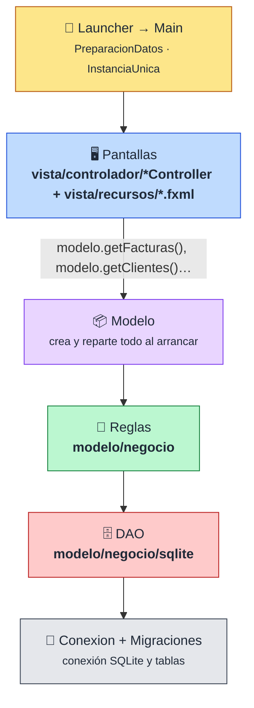
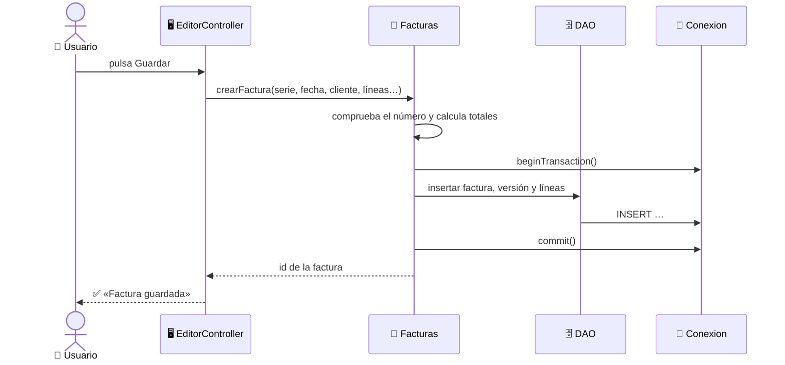
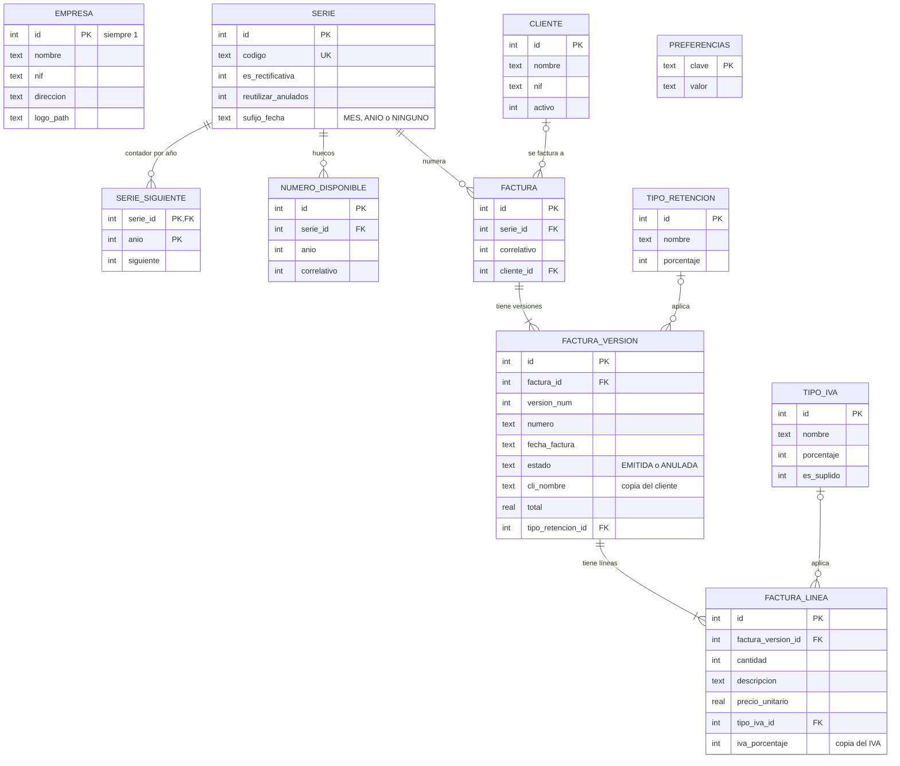

<div align="center">

# 📐 Documentación técnica

**Cómo está construido CaboFactu por dentro**

[⬅️ Volver al README](../README.md) · [🧭 Metodología](metodologia.md)

</div>

---

## 📑 Índice

1. [🏗️ Arquitectura por capas](#️-arquitectura-por-capas)
2. [📁 Paquetes](#-paquetes)
3. [🔄 Ejemplo: guardar una factura](#-ejemplo-guardar-una-factura)
4. [🗃️ Modelo de datos](#️-modelo-de-datos)
5. [⚖️ Decisiones técnicas](#️-decisiones-técnicas)
6. [🧾 Preparación para VeriFactu](#-preparación-para-verifactu)

---

## 🏗️ Arquitectura por capas



| Capa | Qué hace | Qué **no** hace |
|---|---|---|
| 🖥️ **Pantallas** (`vista`) | Leer lo que escribe el usuario, llamar a una regla y mostrar el resultado | Consultas SQL ni reglas de negocio |
| 📦 **Modelo** | Crear una vez todas las reglas y DAO y entregárselos a las pantallas | Lógica |
| 🧠 **Reglas** (`modelo/negocio`) | Decidir: número repetido, totales, qué pasos y en qué orden, transacciones | Saber qué base de datos hay debajo |
| 🗄️ **DAO** (`modelo/negocio/sqlite`) | `SELECT`, `INSERT`, `UPDATE`, `DELETE` de su tabla | Decidir si algo está permitido |
| 🔌 **Conexion** | Abrir la conexión, crear las tablas, `commit` y `rollback` | Nada más |

> [!TIP]
> **💡 Concepto: repositorio = DAO.** Las clases que hablan con las tablas **se llaman** `*DAO` (`FacturaDAO`, `ClienteDAO`…): es lo que en clase llamamos **DAO** (*Data Access Object*). Si mañana se cambia SQLite por otra base de datos, solo se tocan los DAO y `Conexion`.

> [!TIP]
> **💡 Concepto: service.** Es una capa entre la pantalla y el DAO donde viven las **reglas de negocio**. Así la misma regla («no se puede repetir un número de factura») sirve igual si la factura se crea desde el editor o desde la facturación mensual.

> [!TIP]
> **💡 Concepto: inyección por constructor.** `Modelo` hace los `new` una sola vez y pasa a cada clase lo que necesita por su constructor, por ejemplo `new Facturas(facturaDAO, …, clock)`. Así se ve de un vistazo de qué depende cada clase, y en los tests se le puede pasar otra cosa (una fecha fija, por ejemplo).

---

## 📁 Paquetes

```text
src/main/java/cabofactu/
├── 🚀 Launcher, Main         → punto de entrada JavaFX
├── 🚀 PreparacionDatos       → crea la carpeta de datos y carga la demo en una instalación nueva
├── 🚀 InstanciaUnica         → impide abrir dos ventanas a la vez (bloqueo de fichero)
├── 📦 modelo/                → el contenedor Modelo, que crea las reglas y los DAO al arrancar
├── 🧩 modelo/dominio/        → clases de datos: Cliente, Factura, VersionFactura, LineaFactura…
├── 🧠 modelo/negocio/        → reglas: Facturas, Clientes, Numeracion, Calculos…
├── 🗄️ modelo/negocio/sqlite/ → un DAO por tabla, más CopiaSeguridadDAO para las copias
├── 💾 fichero/               → CopiaSeguridad: copias y restauración de la base
├── 📄 pdf/                   → construcción y dibujo del PDF
├── 🖥️ vista/                 → Navegador, ConfiguracionVentana, Ventanas y Vista
├── 🖥️ vista/controlador/     → un Controller por FXML (MenuPrincipalController…)
├── 🖥️ vista/utilidades/      → BarraNavegacion, Dialogos, GestorTemas y PreviaCabecera
└── 🛠️ utilidades/            → formatos y validadores de NIF, código postal y email
```

```text
src/main/resources/cabofactu/vista/recursos/
├── *.fxml                    → una pantalla por fichero (MenuPrincipal, Editor, CopiaSeguridad…)
├── temas/                    → un CSS por tema (biblioteca8, omarchy…)
└── imagenes/                 → icono de la aplicación
```

> [!TIP]
> **💡 Concepto: `record`.** Algunos métodos devuelven varios datos juntos en un `record`, por ejemplo `EmpresaInfo(slug, nombre)`. Un `record` es una **clase de datos inmutable escrita en una línea**: Java genera el constructor y los getters (`info.nombre()`). Se podría hacer igual con una clase normal; solo ahorra escribir.

---

## 🔄 Ejemplo: guardar una factura



1. **La pantalla** recoge los campos, arma los objetos `Cliente` y `LineaFactura` y llama al servicio. No sabe nada de SQL.
2. **El servicio** comprueba que el número no esté ocupado (`Numeracion`), calcula los totales (`Calculos`) y abre una transacción.
3. **Los repositorios** insertan la factura, su primera versión y sus líneas.
4. Si todo va bien se hace **`commit`**; si algo falla, **`rollback`** y no queda nada a medias.

> [!TIP]
> **💡 Concepto: transacción.** Guardar una factura escribe en tres tablas. Una transacción agrupa esas escrituras para que se guarden **todas o ninguna**: nunca queda una factura sin líneas.

> [!TIP]
> **💡 Concepto: excepción no comprobada.** Los DAO convierten `SQLException` en `DatosException`, que hereda de `RuntimeException`. Así las pantallas y los servicios no tienen que declarar `throws SQLException` y no dependen de que haya una base de datos SQL debajo.

---

## 🗃️ Modelo de datos

Cada empresa tiene **su propio fichero** `facturas.db` con estas tablas (campos principales):



> [!TIP]
> **💡 Concepto: factura y versión.** `FACTURA` solo guarda la **identidad** (serie y correlativo). Todo lo que puede cambiar (fecha, cliente, importes, estado) va en `FACTURA_VERSION`. Así, al corregir una factura se puede crear una versión nueva sin perder la anterior.

> [!TIP]
> **💡 Concepto: copiar datos en la factura.** La versión guarda una **copia** del nombre y NIF del cliente (`cli_*`) y cada línea guarda una copia del IVA aplicado. Si mañana cambia la dirección del cliente o se desactiva un tipo de IVA, las facturas antiguas siguen mostrando lo que se emitió.

---

## ⚖️ Decisiones técnicas

| Decisión | Alternativa descartada | Por qué |
|---|---|---|
| **Aplicación de escritorio** con JavaFX | Aplicación web | La usa una sola persona en su ordenador, sin conexión obligatoria ni servidor que mantener |
| **SQLite** | MySQL / PostgreSQL | No hay que instalar ni configurar un servidor: la base es un fichero junto a los datos del usuario |
| **Una base de datos por empresa** | Una base con una columna `empresa_id` en todas las tablas | Aislamiento total: es imposible que una consulta mezcle datos de dos empresas, y copiar o borrar una empresa es copiar o borrar una carpeta |
| **Datos en `%APPDATA%`** | Junto al programa | Windows no deja escribir en `Program Files`, y así reinstalar el programa no borra las facturas |
| **Capas negocio + DAO** | Reglas y SQL en la misma clase | Las reglas se prueban y reutilizan sin tocar SQL, y cambiar de base de datos solo afecta a los DAO |
| **Nombres en español al estilo Biblioteca8** | Nombres en inglés (`Service`, `Repository`) | Coherencia con el resto del código y con lo visto en clase |
| **`BigDecimal`** con redondeo `HALF_UP` a 2 decimales | `double` | `double` no representa bien los céntimos (0,1 + 0,2 ≠ 0,3) y en facturas un céntimo importa |
| **Versiones de factura** | Sobrescribir siempre | Conservar qué se cambió y cuándo |
| **Copias con `VACUUM INTO`** | Copiar el fichero `.db` a mano | Genera una copia **consistente** aunque la aplicación esté usando la base en ese momento |
| **Restaurar con copia de rescate** | Sustituir directamente | Si la restauración falla, se vuelve automáticamente a la base anterior |
| **`Clock` inyectado** | `LocalDate.now()` repartido por el código | Permite fijar la fecha en los tests y tener una sola fuente de fecha y hora |
| **Excepción de datos no comprobada** | `throws SQLException` en todas las capas | Las capas altas no dependen del driver JDBC |
| **Instancia única con bloqueo de fichero** | Permitir varias ventanas | SQLite con un solo usuario: dos ventanas escribiendo a la vez podrían pisarse |
| **Migraciones versionadas** (`PRAGMA user_version`) | Crear las tablas a mano | Una base antigua se actualiza sola al abrirla |
| **OpenPDF** | Generar el PDF desde otra herramienta | Librería Java libre que permite dibujar cabecera, tablas y pie a medida |

---

## 🧾 Preparación para VeriFactu

**VeriFactu** es el sistema de la Agencia Tributaria para que los programas de facturación garanticen que las facturas **no se alteran** después de emitirlas: cada factura genera un registro con una **huella** (hash) encadenada a la anterior y el PDF lleva un **código QR**.

> [!WARNING]
> Las fechas de obligación y la especificación técnica han cambiado varias veces. Antes de implementar nada hay que comprobar la versión vigente en la web de la AEAT.

Tras la [auditoría de la arquitectura](metodologia.md#-auditoría-de-la-arquitectura-con-ia) esta es la situación:

| Qué pide VeriFactu (resumen) | Situación en CaboFactu |
|---|---|
| Separar bien capas y un único punto de emisión | ✅ Capas separadas · ⏳ la emisión aún se hace desde varios sitios |
| Fecha y hora fiables | ✅ `Clock` inyectado · ⏳ falta guardar la zona horaria |
| Registro de facturación con huella encadenada | ⏳ No existe todavía |
| Datos fiscales (tipo de factura, clave de régimen, tipo de rectificativa) | ⏳ Faltan en el modelo de datos |
| Factura emitida inalterable | ⏳ Hoy una emitida se puede editar y borrar: decisión pendiente |
| QR y leyenda en el PDF | ⏳ El generador de PDF permite añadirlos |

---

<div align="center">

[⬅️ Volver al README](../README.md) · [🧭 Metodología](metodologia.md)

</div>
