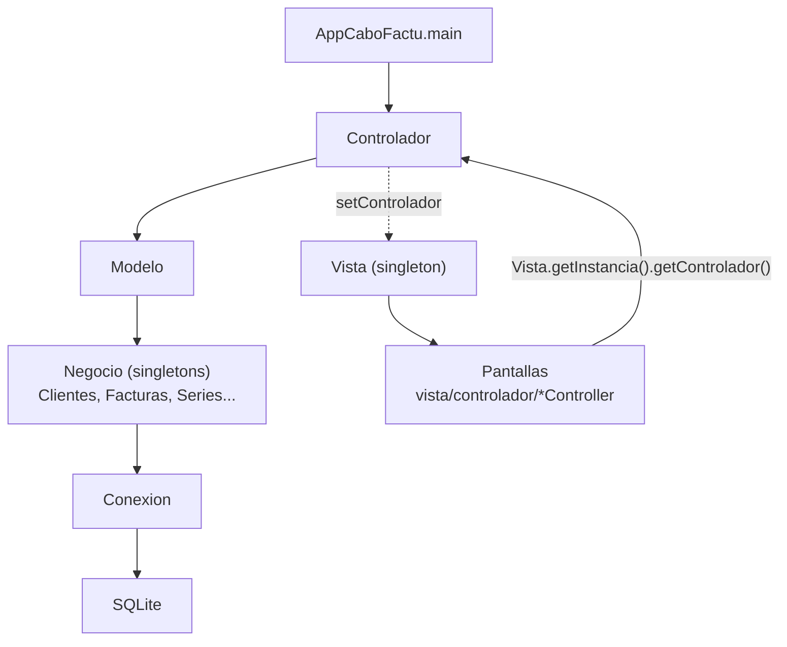
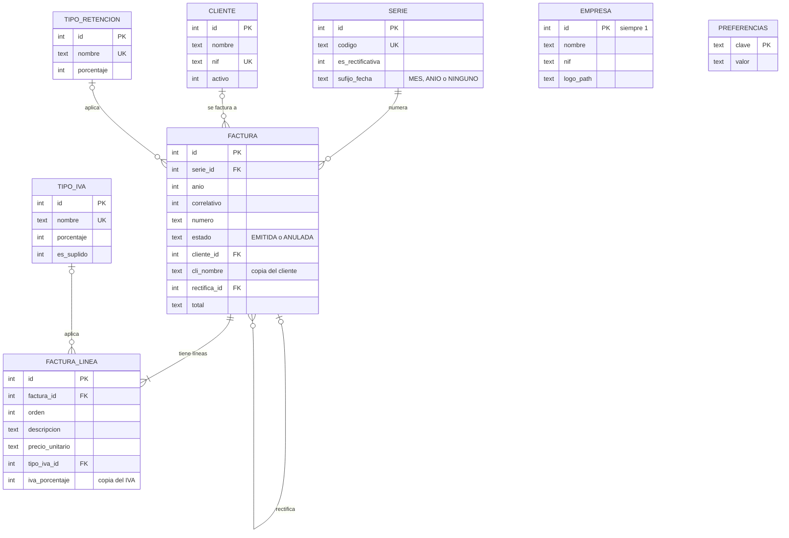

<div align="center">

# Documentación técnica

**Cómo está construido CaboFactu por dentro**

[Volver al README](../README.md) · [Metodología](metodologia.md) · [Flujos](flujos.md) · [Diseño](diseno.md)

</div>

---

## Índice

1. [Arquitectura MVC como Biblioteca8](#arquitectura-mvc-como-biblioteca8)
2. [Paquetes](#paquetes)
3. [Clases de datos, negocio y pantallas](#clases-de-datos-negocio-y-pantallas)
4. [Modelo de datos](#modelo-de-datos)
5. [Tests](#tests)
6. [Decisiones técnicas](#decisiones-técnicas)
7. [VeriFactu](#verifactu)

---

## Arquitectura MVC como Biblioteca8


```mermaid
flowchart TD
    A["AppCaboFactu.main"] --> B["Controlador"]
    B --> C["Modelo"]
    C --> D["Negocio (singletons)<br/>Clientes, Facturas, Series..."]
    D --> E["Conexion"]
    E --> F["SQLite"]
    G["Pantallas<br/>vista/controlador/*Controller"] -->|"Vista.getInstancia().getControlador()"| B
    H["Vista (singleton)"] --> G
    B -.->|"setControlador"| H
```

| Capa | Qué hace | Qué **no** hace |
|---|---|---|
| **Pantallas** (`vista/controlador`) | Leer lo que escribe el usuario, llamar al controlador y mostrar el resultado | SQL ni reglas de negocio |
| **[`Vista`](../src/main/java/cabofactu/vista/Vista.java)** | Guardar la ventana y la pantalla actual, y cambiar de pantalla (`mostrar`, `crearVentanaModal`) | Reglas de negocio |
| **[`Controlador`](../src/main/java/cabofactu/controlador/Controlador.java)** | Une la vista y el modelo. Arranca la aplicación (carpeta de datos, instancia única, demo) y la cierra (suelta el bloqueo y la base). Es **la única puerta** de las pantallas hacia los datos: una pantalla solo conoce `Vista.getInstancia().getControlador()` | Guardar ni decidir nada: no sabe cómo ni dónde se guardan los datos |
| **[`Modelo`](../src/main/java/cabofactu/modelo/Modelo.java)** | Reúne en un solo sitio todo lo que la aplicación sabe hacer con sus datos, y sabe a qué clase de negocio le toca cada operación: `altaFactura` a `Facturas`, `siguienteCorrelativo` a `Series`. También guarda la sesión (fecha de trabajo) | SQL ni pantallas |
| **Negocio** (`modelo/negocio`) | Decidir: comprobar, calcular totales, numerar, transacciones. El SQL de sus tablas vive dentro | Saber qué pantalla la llama |
| **`Conexion`** | Abrir y cerrar la conexión SQLite y crear las tablas con el script | Transacciones ni consultas: eso es de cada clase de negocio |

### Para qué sirven el `Controlador` y el `Modelo`

La mayoría de sus métodos tienen una línea, y es buena señal: cada decisión está en su sitio. Las reglas están en el negocio, y las pantallas solo leen y enseñan. Si un método del `Controlador` necesitara diez líneas, sería que alguna regla se ha colado donde no toca.

- **Separan las capas**. Las 13 pantallas no importan nada de `modelo/negocio` ni de SQLite; solo hablan con el `Controlador`. Si mañana cambia cómo se guarda algo (otra base de datos, o el PDF con JasperReports), el cambio se queda en el negocio y no se toca ninguna pantalla.
- **Son el índice de la aplicación**. Leyendo el `Controlador` se ven todas las operaciones que hay, con nombres de verbo y entidad (`altaCliente`, `anularFactura`, `restaurarCopia`…), sin abrir ninguna pantalla.
- **Son el sitio para lo que afecta a todas las operaciones**. Si hubiera que comprobar la sesión o apuntar cada operación en un registro, se haría en un único punto, sin tocar pantallas ni negocio.
- Es el MVC de Biblioteca8, el que se ve en clase: Vista, Controlador y Modelo, cada uno con su papel.

`AppCaboFactu.main` en cuatro líneas:

```java
Modelo modelo = new Modelo();
Vista vista = Vista.getInstancia();
Controlador controlador = new Controlador(modelo, vista);
controlador.comenzar();
```

No hay clases `*DAO` ni `*Service`: cada clase de `modelo/negocio` (`Clientes`, `Facturas`, `Series`...) es un singleton (`Clientes.getClientes()`) que lleva dentro el SQL de sus propias tablas, con las columnas escritas a mano (nunca `SELECT *`) y las transacciones (`setAutoCommit(false)` / `commit` / `rollback`) escritas en el propio método.

## Paquetes

```text
src/main/java/cabofactu/
├── AppCaboFactu             → punto de entrada: crea Modelo, Vista y Controlador
├── PreparacionDatos         → crea la carpeta de datos y carga la demo en una instalación nueva
├── InstanciaUnica           → bloqueo de fichero para que solo haya una ventana abierta
├── controlador/             → Controlador: une vista y modelo; arranca y cierra la aplicación
├── modelo/                  → Modelo: todas las operaciones con los datos, en un solo sitio
├── modelo/dominio/          → clases de datos: Cliente, Factura, Serie, LineaFactura, Empresa...
├── modelo/negocio/          → singletons con el SQL dentro: Clientes, Facturas, Series, Empresas,
│                              Configuracion, TiposIva, TiposRetencion, CopiaSeguridad, Calculos,
│                              FacturacionMensual, Sesion, PreferenciasGlobales
├── modelo/negocio/sqlite/   → Conexion (conexión y creación de tablas) y CargarDemo (empresa demo)
├── pdf/                     → construcción y dibujo del PDF (ExportadorPdf, GeneradorPdf...)
├── vista/                   → Vista (singleton), Pantalla, LanzadorVentanaPrincipal, Ventanas
├── vista/controlador/       → un Controller por FXML (MenuPrincipalController, EditorController...)
├── vista/recursos/          → LocalizadorRecursos, que busca los FXML en el classpath
├── vista/utilidades/        → Dialogos, GestorTemas, Botones, CambiosSinGuardar, ErroresInesperados...
└── utilidades/              → Formatos y validadores: NIF, código postal, email
```

```text
src/main/resources/
├── cabofactu/vista/recursos/
│   ├── *.fxml                → una pantalla por fichero (13 en total)
│   ├── temas/                → un CSS por tema: biblioteca8, omarchy, esmeralda, terracota,
│   │                            negro-dorado, sakura, neon, más base.css común
│   └── imagenes/             → icono de la aplicación
└── db/
    ├── crear_tablas.sql      → el único script de creación de tablas
    ├── seed_demo.sql         → los datos de la empresa de demostración
    └── logo_demo.png         → el logo de la empresa de demostración
```

Cómo se diseñaron los temas y los iconos, antes de programarlos, en [docs/diseno.md](diseno.md).

## Clases de datos, negocio y pantallas

Las reglas completas están en [`AGENTS.md`](../AGENTS.md); aquí, las principales:

| Bloque | Regla | Ejemplo en el código |
|---|---|---|
| Clases de datos (`modelo/dominio`) | El setter valida y lanza `Exception` con el mensaje para el usuario | [`Cliente`](../src/main/java/cabofactu/modelo/dominio/Cliente.java)`.setNif` comprueba forma y letra antes de asignar |
| Clases de datos | Constructor copia, para editar sin tocar el original | `new Cliente(otro)` |
| Negocio (`modelo/negocio`) | Singleton con el SQL de sus tablas dentro, sin DAO | [`Facturas`](../src/main/java/cabofactu/modelo/negocio/Facturas.java)`.getFacturas().alta(factura)` |
| Negocio | Transacción escrita en el propio método | `Facturas.alta`: `setAutoCommit(false)`, `INSERT`, `commit`, `rollback` en el `catch` |
| Pantallas (`vista/controlador`) | Tabla + alta y edición con un formulario modal reutilizable | [`FichaClienteController`](../src/main/java/cabofactu/vista/controlador/FichaClienteController.java)`.setRegistro(cliente)` / `getRegistro()` |
| Pantallas | Un único `catch (Exception e)` que muestra `e.getMessage()` | Todos los botones de guardar |

## Modelo de datos

Cada empresa tiene su propia base SQLite en `%APPDATA%\Facturacion\<empresa>\facturas.db`, creada con [`db/crear_tablas.sql`](../src/main/resources/db/crear_tablas.sql) (campos principales):


```mermaid
erDiagram
    CLIENTE {
        int id PK
        text nombre
        text nif UK
        int activo
    }
    SERIE {
        int id PK
        text codigo UK
        int es_rectificativa
        text sufijo_fecha "MES, ANIO o NINGUNO"
    }
    FACTURA {
        int id PK
        int serie_id FK
        int anio
        int correlativo
        text numero
        text estado "EMITIDA o ANULADA"
        int cliente_id FK
        text cli_nombre "copia del cliente"
        int rectifica_id FK
        text total
    }
    FACTURA_LINEA {
        int id PK
        int factura_id FK
        int orden
        text descripcion
        text precio_unitario
        int tipo_iva_id FK
        int iva_porcentaje "copia del IVA"
    }
    TIPO_IVA {
        int id PK
        text nombre UK
        int porcentaje
        int es_suplido
    }
    TIPO_RETENCION {
        int id PK
        text nombre UK
        int porcentaje
    }
    EMPRESA {
        int id PK "siempre 1"
        text nombre
        text nif
        text logo_path
    }
    PREFERENCIAS {
        text clave PK
        text valor
    }

    SERIE ||--o{ FACTURA : "numera"
    CLIENTE |o--o{ FACTURA : "se factura a"
    FACTURA ||--|{ FACTURA_LINEA : "tiene líneas"
    FACTURA |o--o{ FACTURA : "rectifica"
    TIPO_IVA |o--o{ FACTURA_LINEA : "aplica"
    TIPO_RETENCION |o--o{ FACTURA : "aplica"
```

**Por qué la factura guarda una copia del cliente y cada línea una copia del IVA**: `factura` guarda columnas `cli_*` con el nombre, NIF y dirección del cliente tal como estaban al emitirla, y `factura_linea` guarda `iva_porcentaje` además de `tipo_iva_id`. Así, si mañana cambia la dirección del cliente o se desactiva un tipo de IVA, las facturas ya emitidas siguen mostrando exactamente lo que se facturó.

No hay tabla de versiones ni de huecos de numeración: el siguiente número de una serie se calcula en [`Series`](../src/main/java/cabofactu/modelo/negocio/Series.java) a partir de los correlativos ya usados en ese año (el mayor más uno), los huecos que dejan las facturas eliminadas se ofrecen como números libres, y `factura` es una única fila por factura (sin historial de cambios).

## Tests

Tres capas, más dos de apariencia, todas con `mvn test` (**469 pruebas** en total):

| Capa | Qué prueba | Ejemplo |
|---|---|---|
| Negocio y clases de datos | Contra una base SQLite temporal, sin JavaFX | `FacturasTest`, `ClienteTest`, `SeriesTest` |
| Carga de pantallas | Un único test que abre los 13 FXML y comprueba que no hay errores de cableado | `CargaPantallasTest` |
| Pruebas de pantalla | TestFX en modo *headless*, manejando los controles como el usuario; heredan de `PruebaDePantalla` | `PantallaEditorTest`, `PantallaCopiasTest`... |
| Apariencia (temas) | Cada uno de los 7 temas define su paleta completa | `TemasTest` |
| Apariencia (textos) | Ningún texto se recorta con la ventana en su tamaño mínimo | `TextosCompletosTest` |

JavaFX se arranca una sola vez por proceso de pruebas, desde `PruebasJavaFx` (con `FxToolkit`): arrancarlo dos veces hace que el robot deje de ver las ventanas de los avisos.

**Se quedan a mano**, porque no hay forma razonable de automatizarlos: los diálogos de archivos de Windows (`FileChooser` y `DirectoryChooser`), el aspecto real del PDF generado y si una pantalla queda bien a simple vista.

## Decisiones técnicas

| Decisión | Alternativa descartada | Por qué |
|---|---|---|
| Aplicación de escritorio con JavaFX | Aplicación web | La usa una sola persona en su ordenador, sin servidor que mantener |
| SQLite | MySQL / PostgreSQL | No hay que instalar ni configurar un servidor: la base es un fichero |
| Una base de datos por empresa | Una base con `empresa_id` en cada tabla | Aislamiento total: copiar o borrar una empresa es copiar o borrar una carpeta |
| Singletons con el SQL dentro (como Biblioteca8) | Capas negocio + DAO separadas | Menos clases e indirección para un proyecto de un alumno de 1º de DAM |
| `Exception` por defecto; una propia solo si aporta algo | Excepciones propias siempre (`DatosException`) | Menos tipos que mantener; una propia solo cuando un `catch` la va a tratar aparte |
| Sin hilos: cursor de espera | `Task` y `Thread` para operaciones largas | Nada que sincronizar ni que se pueda quedar a medias |
| Manejador global de errores con aviso y `errores.log` | Dejar que el error salga por consola | Un error no previsto avisa al usuario y queda anotado en vez de perderse |
| Un único script de tablas (`db/crear_tablas.sql`) | Migraciones versionadas | En una aplicación en desarrollo las tablas son siempre las últimas |
| Copias con `VACUUM INTO` | Copiar el fichero `.db` a mano | Genera una copia consistente aunque la aplicación esté usando la base |
| La copia se comprueba contra `crear_tablas.sql` | Listas de tablas y columnas escritas a mano | Se crea una base vacía en memoria con el script y se compara: no hay que tocar dos sitios con cada cambio de esquema |
| Copia de rescate al restaurar | Sustituir la base directamente | Si la restauración falla, se puede volver a la base anterior |
| `BigDecimal` con redondeo `HALF_UP` a 2 decimales | `double` | `double` no representa bien los céntimos (0,1 + 0,2 ≠ 0,3) |
| Instancia única con bloqueo de fichero | Permitir varias ventanas | SQLite con un solo usuario: dos ventanas escribiendo a la vez podrían pisarse |
| Datos en `%APPDATA%` | Junto al programa | Windows no deja escribir en `Program Files`, y reinstalar no borra las facturas |
| Sin versiones de factura | Guardar cada cambio como una versión nueva | Una fila por factura; simplifica el modelo mientras el proyecto está en desarrollo |
| OpenPDF, por ahora | JasperReports | Librería Java libre para dibujar cabecera, tablas y pie a medida. La rama `pdf-jasper` lo sustituirá por JasperReports, con plantillas diseñadas en Jaspersoft Studio |

## VeriFactu

**VeriFactu** es el sistema de la Agencia Tributaria para que los programas de facturación garanticen que las facturas no se alteran después de emitirlas: cada factura genera un registro con una huella (hash) encadenada a la anterior, y el PDF lleva un código QR.

Las fechas de obligación y la especificación técnica han cambiado varias veces; antes de implementar nada hay que comprobar la versión vigente en la web de la AEAT.

Situación de CaboFactu hoy:

| Qué pide VeriFactu (resumen) | Situación en CaboFactu |
|---|---|
| Un único punto de emisión | Parcial: la emisión se hace desde el editor y desde la facturación mensual |
| Registro de facturación con huella encadenada | No existe todavía |
| Datos fiscales (tipo de factura, clave de régimen, tipo de rectificativa) | Faltan en el modelo de datos |
| Factura emitida inalterable | Hoy una emitida se puede editar, anular y restaurar: decisión pendiente |
| QR y leyenda en el PDF | El generador de PDF permite añadirlos cuando se aborde |

Se implementará al final, en su propia rama (ver «Qué toca ahora» en [`ESTADO.md`](../ESTADO.md)).

---

<div align="center">

[Volver al README](../README.md) · [Metodología](metodologia.md) · [Flujos](flujos.md) · [Diseño](diseno.md)

</div>
